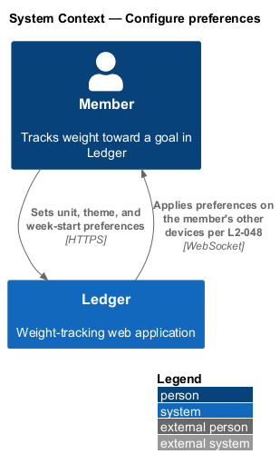
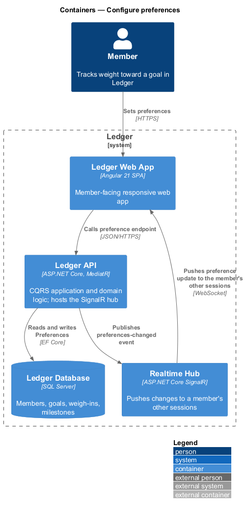
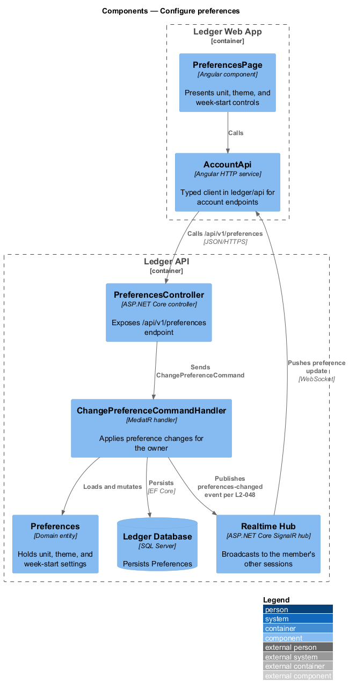
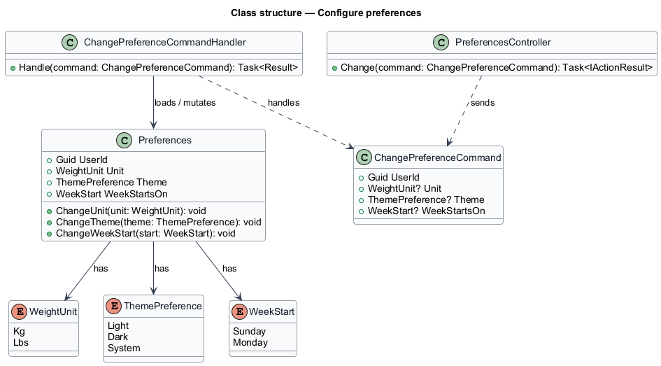
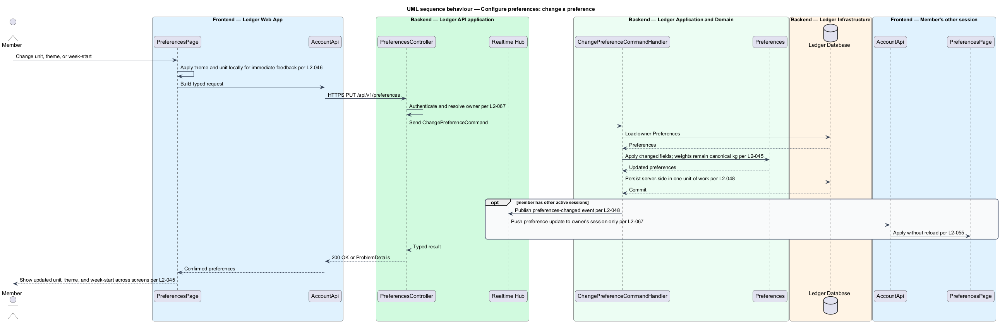

# Configure preferences

## Overview

Ledger is a responsive web application for weight tracking. Each member holds a
set of display and calendar preferences that shape how the app reads. This
feature covers changing those preferences and having the change persist and
propagate to the member's other devices.

*preference* — a per-member setting that governs presentation or calendar
arithmetic without altering stored data

Three preferences are in scope: the weight *unit* (kilograms or pounds), the
*theme* (light, dark, or system), and the *week start* (the first day of the
week). A change to the unit re-renders every weight across the app, converted
from the canonical value, while the stored data is unchanged — weight remains in
kilograms and repeated toggling shall not drift the values. A change to the week
start moves the boundary used by weekly aggregates. Preferences persist
server-side per member and apply on the member's other devices on next load or
through the real-time channel.

This document assumes no prior knowledge of Ledger's internals. Terms are
defined at first use, and the diagrams show where each part lives.

## Description

The feature is a vertical slice that runs from the preferences screen to the
database, with a real-time push to the member's other sessions.

- **`PreferencesPage`** — Angular component in the Ledger Web App. It presents
  the unit, theme, and week-start controls and applies theme and unit locally
  for immediate feedback.
- **`AccountApi`** — typed Angular HTTP client in the `ledger/api` library. It
  builds the preference request and returns a typed result to the page.
- **`PreferencesController`** — ASP.NET Core controller in the Ledger API. It
  exposes the `/api/v1/preferences` endpoint, authenticates the caller, resolves
  the owner, and dispatches the command.
- **`ChangePreferenceCommand`** — request object carrying the `UserId` and the
  optional changed fields (`Unit`, `Theme`, `WeekStartsOn`).
- **`ChangePreferenceCommandHandler`** — MediatR handler that loads the owner
  `Preferences`, applies the changed fields, persists them in one unit of work,
  and publishes a preferences-changed event to the realtime hub.
- **`Preferences`** — domain entity holding `Unit`, `Theme`, `WeekStartsOn`, and
  the reminder fields configured in the manage-reminders feature.
- **Realtime Hub** — ASP.NET Core SignalR hub, hosted in the Ledger API, that
  pushes the changed preferences to the member's other authenticated sessions.

## Requirements

The feature realizes the following level-2 (L2) requirements. Each L2 refines a
level-1 (L1) requirement, cited by identifier.

| L2 ID | Refines (L1) | Requirement |
|-------|--------------|-------------|
| `L2-045` | `L1-010` | Users choose kg or lbs; all displays follow. |
| `L2-046` | `L1-010` | Users choose theme. |
| `L2-047` | `L1-010` | Users choose the first day of the week. |
| `L2-048` | `L1-010` | Preferences persist server-side per user. |

## Diagrams

### System context

The member sets unit, theme, and week-start preferences through Ledger; the
change persists and applies across the member's devices.

### Containers

The change travels from the Ledger Web App to the Ledger API, which persists
`Preferences` in the Ledger Database and pushes the update to the member's other
sessions through the Realtime Hub.

### Components

Inside the Ledger API, `PreferencesController` dispatches `ChangePreferenceCommand`
to its handler, which mutates the `Preferences` entity, persists it, and
publishes a preferences-changed event to the Realtime Hub.

### Class structure

`ChangePreferenceCommandHandler` depends on `ChangePreferenceCommand`, loads and
mutates `Preferences`, and the entity holds the `WeightUnit`, `ThemePreference`,
and `WeekStart` enumerations.

### Behaviour — change a preference

The handler applies the changed fields while weights remain canonical kilograms
per `L2-045`, persists server-side per `L2-048`, and pushes the update to the
member's other sessions per `L2-055`.

