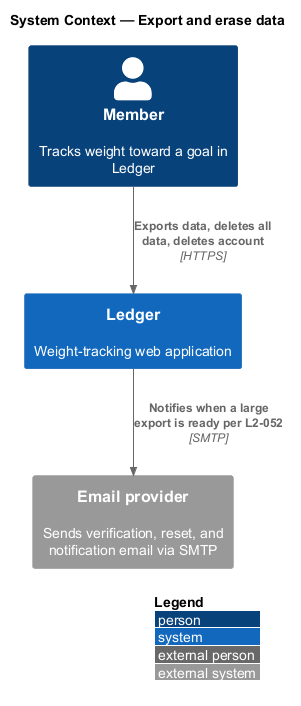
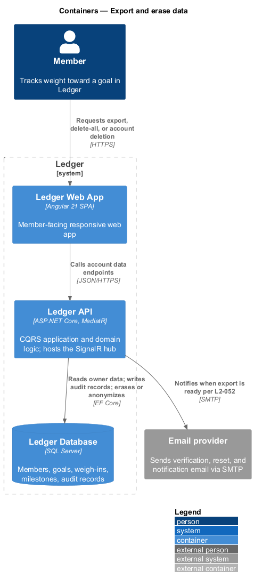
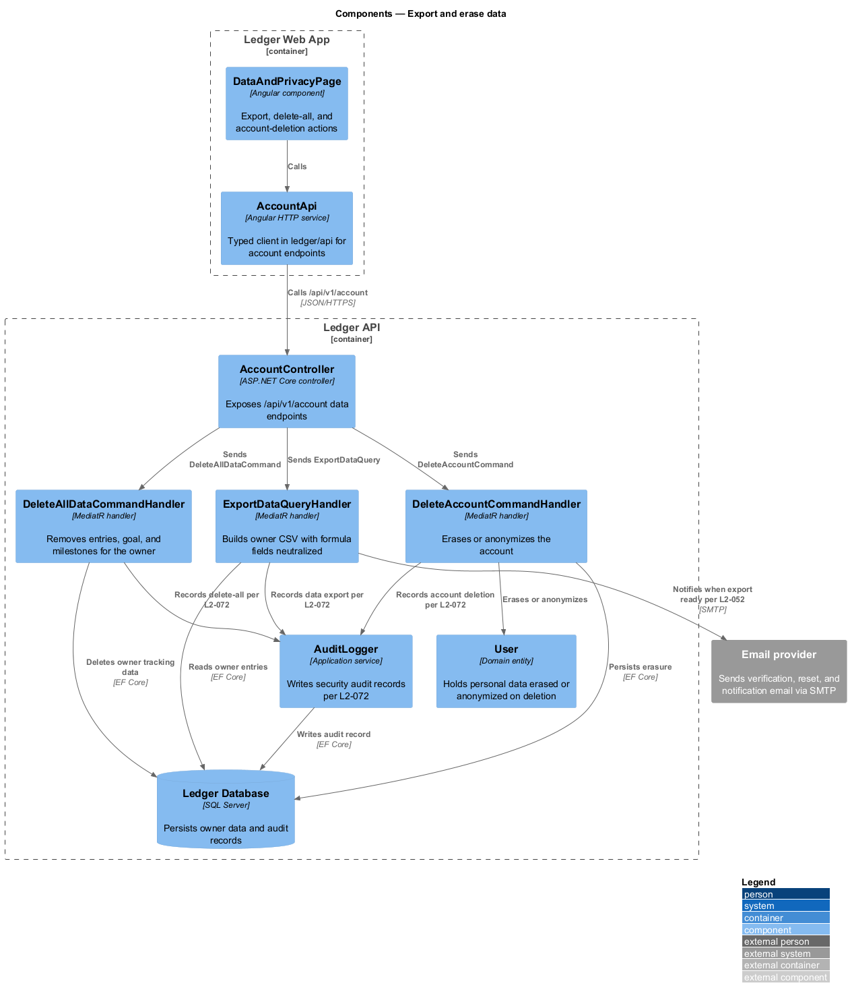
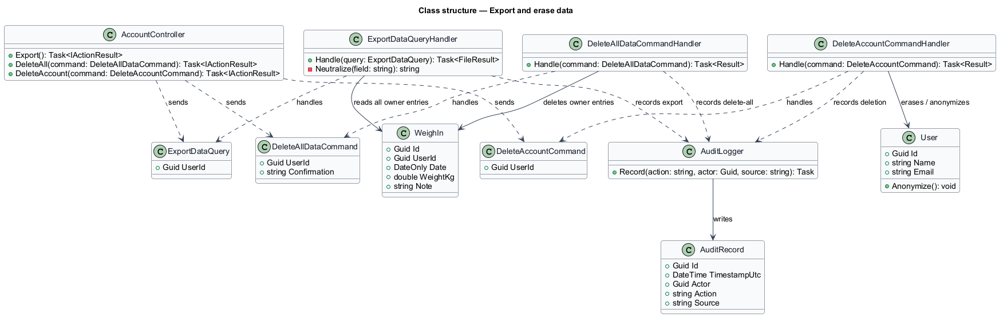
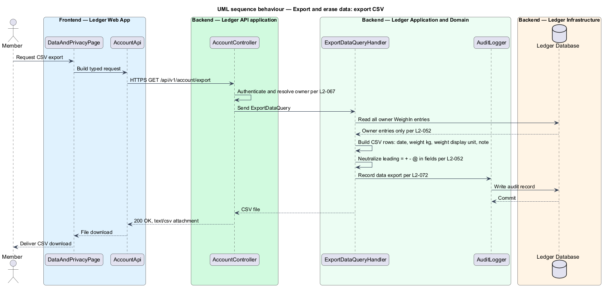
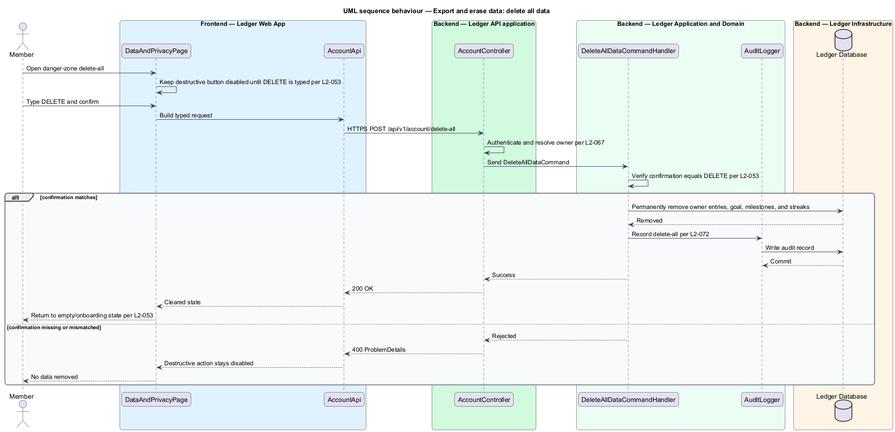
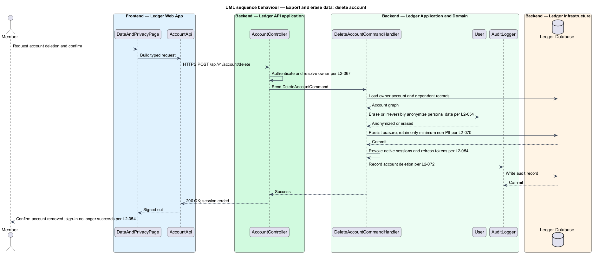

# Export and erase data

## Overview

Ledger is a responsive web application for weight tracking. A member owns their
tracking data and their account, and this feature gives them control over both:
exporting all entries as a file, erasing all tracking data, and deleting the
account. Each action is scoped to the authenticated owner and the destructive
actions are audit-logged.

*export* — a downloadable CSV containing all of the owner's entries

*delete-all* — permanent removal of the owner's entries, goal, and
milestone/streak data, leaving the account intact

*account deletion* — permanent erasure or irreversible anonymization of the
account and its personal data

The export contains one row per entry with the date, the canonical weight in
kilograms, the weight in the member's display unit, and the note; fields that
could be read as spreadsheet formulas are neutralized so an opened file executes
no embedded content. Delete-all is guarded by a typed `DELETE` confirmation and
cannot be undone. Account deletion erases or anonymizes personal data, revokes
active sessions, and retains only the minimum non-PII records. Data export,
delete-all, and account deletion each write a security audit record.

This document assumes no prior knowledge of Ledger's internals. Terms are
defined at first use, and the diagrams show where each part lives.

## Description

The feature is a vertical slice with three behaviours: export, delete-all, and
account deletion, all reached from the account's data-and-privacy screen.

- **`DataAndPrivacyPage`** — Angular component in the Ledger Web App. It offers
  the export action, the delete-all danger zone with its typed confirmation, and
  the account-deletion action.
- **`AccountApi`** — typed Angular HTTP client in the `ledger/api` library. It
  builds the account data requests and returns typed results to the page.
- **`AccountController`** — ASP.NET Core controller in the Ledger API. It exposes
  the `/api/v1/account` data endpoints, authenticates the caller, resolves the
  owner, and dispatches the query or command.
- **`ExportDataQuery`** — request object identifying the owner whose entries are
  exported. Export reads data and produces a file without mutating state, so it
  is modeled as a query.
- **`ExportDataQueryHandler`** — MediatR handler that reads all owner `WeighIn`
  entries, builds the CSV, and neutralizes formula-triggering leading characters.
- **`DeleteAllDataCommand`** — request object carrying the `UserId` and the typed
  `Confirmation` text.
- **`DeleteAllDataCommandHandler`** — MediatR handler that verifies the
  confirmation, permanently removes the owner's tracking data, and records the
  action.
- **`DeleteAccountCommand`** — request object identifying the account to erase.
- **`DeleteAccountCommandHandler`** — MediatR handler that erases or anonymizes
  the `User`, revokes sessions, retains only minimum non-PII, and records the
  action.
- **`AuditLogger`** — application service that writes an `AuditRecord` for each
  export, delete-all, and account deletion.
- **`User`** — domain entity whose personal fields are anonymized or erased on
  account deletion.
- **Email provider** — external system that notifies the member when a large,
  asynchronous export is ready.

## Requirements

The feature realizes the following level-2 (L2) requirements. Each L2 refines a
level-1 (L1) requirement, cited by identifier.

| L2 ID | Refines (L1) | Requirement |
|-------|--------------|-------------|
| `L2-052` | `L1-012` | The user exports all entries. |
| `L2-053` | `L1-012` | The user erases all entries/goal/milestones with explicit confirmation. |
| `L2-054` | `L1-012` | The user can delete their entire account. |
| `L2-070` | `L1-016` | Sensitive data is protected and minimized. |
| `L2-072` | `L1-016` | Security-relevant events are audit-logged. |

## Diagrams

### System context

The member exports and erases their data through Ledger, which notifies them
through an external email provider when a large export is ready.

### Containers

The requests travel from the Ledger Web App to the Ledger API, which reads owner
data, writes audit records, and erases or anonymizes data in the Ledger Database.

### Components

Inside the Ledger API, `AccountController` dispatches `ExportDataQuery`,
`DeleteAllDataCommand`, and `DeleteAccountCommand`; the destructive handlers
record the action through `AuditLogger`.

### Class structure

The controller sends one query and two commands; their handlers read or erase
owner data and record each action through `AuditLogger`, which writes an
`AuditRecord`.

### Behaviour — export CSV

The handler reads all owner entries per `L2-052`, neutralizes formula-triggering
leading characters per `L2-052`, and records the export per `L2-072`.

### Behaviour — delete all data

The handler verifies the typed `DELETE` confirmation per `L2-053`, permanently
removes the owner's tracking data, and records the action per `L2-072`.

### Behaviour — delete account

The handler erases or anonymizes personal data per `L2-054`, retains only minimum
non-PII per `L2-070`, revokes sessions, and records the deletion per `L2-072`.

