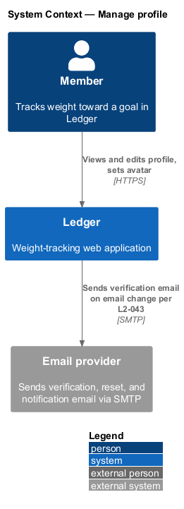
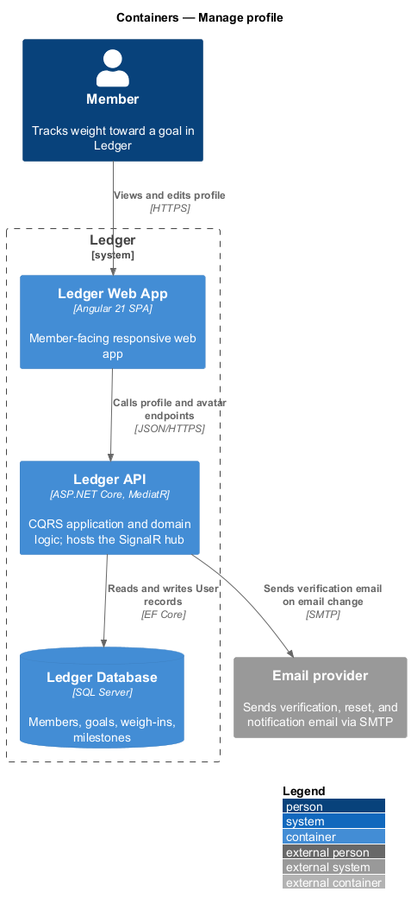
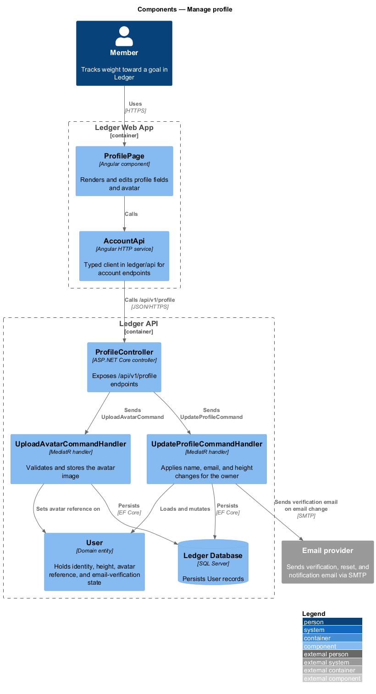
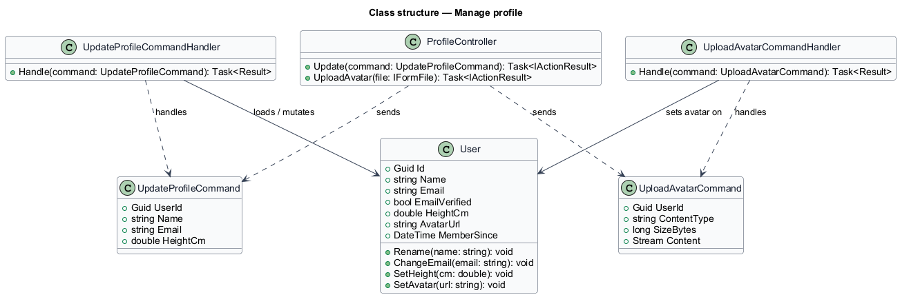
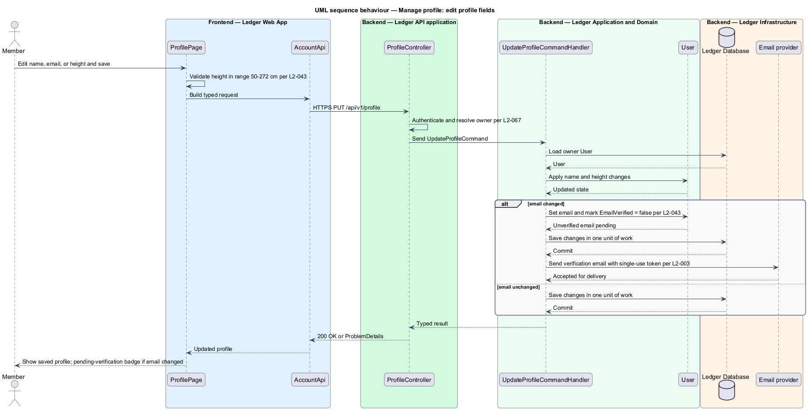
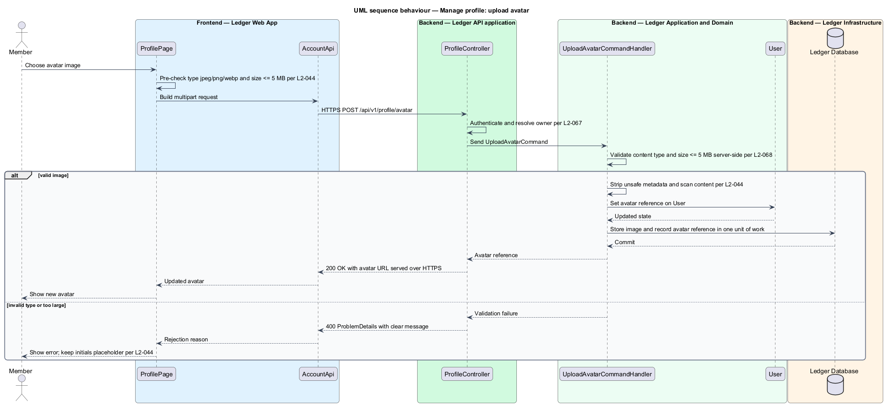

# Manage profile

## Overview

Ledger is a responsive web application for weight tracking. A *member* sets a
goal weight and target date, logs a daily weigh-in, and reads the trend toward
the goal. This feature covers the member's own account identity: viewing the
profile, editing its fields, and setting an avatar.

*profile* — the member's identity record and journey summary: avatar, name,
email, membership date, height, and derived stats

*avatar* — image that represents the member across the app; an initial-based
placeholder stands in when none is set

The profile presents identity together with journey figures (start, current,
goal, total lost, percent to goal) and the member's height with its derived BMI.
Editing is confined to the authenticated owner. Two fields carry extra rules: a
change of email returns the account to an unverified state and triggers a fresh
verification email, and an avatar upload is validated for type and size before
it is stored. Weight remains stored canonically in kilograms; the profile's
journey figures render in the member's unit preference.

This document assumes no prior knowledge of Ledger's internals. Terms are
defined at first use, and the diagrams show where each part lives.

## Description

The feature is a vertical slice that runs from the profile screen to the
database.

- **`ProfilePage`** — Angular component in the Ledger Web App. It renders the
  profile, hosts the edit form for name, email, and height, and offers the
  avatar picker.
- **`AccountApi`** — typed Angular HTTP client in the `ledger/api` library. It
  builds requests for the account endpoints and returns typed results to the
  page.
- **`ProfileController`** — ASP.NET Core controller in the Ledger API. It exposes
  the `/api/v1/profile` endpoints, authenticates the caller, resolves the owner,
  and dispatches commands.
- **`UpdateProfileCommand`** — request object carrying the target `UserId` and
  the edited `Name`, `Email`, and `HeightCm`.
- **`UpdateProfileCommandHandler`** — MediatR handler that loads the owner `User`,
  applies the field changes, and persists them in one unit of work. When the
  email changes it marks the account unverified and sends a verification email.
- **`UploadAvatarCommand`** — request object carrying the `UserId`, the image
  `ContentType`, `SizeBytes`, and `Content`.
- **`UploadAvatarCommandHandler`** — MediatR handler that validates the image
  type and size server-side, strips unsafe metadata, stores the image, and
  records the avatar reference on the `User`.
- **`User`** — domain entity holding identity (`Name`, `Email`), the
  `EmailVerified` flag, `HeightCm`, `AvatarUrl`, and `MemberSince`.
- **Email provider** — external system that delivers the verification email when
  the email address changes.

## Requirements

The feature realizes the following level-2 (L2) requirements. Each L2 refines a
level-1 (L1) requirement, cited by identifier.

| L2 ID | Refines (L1) | Requirement |
|-------|--------------|-------------|
| `L2-042` | `L1-009` | The profile screen shows identity and journey. |
| `L2-043` | `L1-009` | The user edits profile fields. |
| `L2-044` | `L1-009` | The user sets a profile photo. |

## Diagrams

### System context

The member views and edits the profile through Ledger, which sends a
verification email through an external email provider when the email address
changes.

### Containers

The edits travel from the Ledger Web App to the Ledger API, which persists `User`
records in the Ledger Database and calls the email provider on an email change.

### Components

Inside the Ledger API, `ProfileController` dispatches `UpdateProfileCommand` and
`UploadAvatarCommand` to their handlers, which mutate the `User` entity and
persist it.

### Class structure

`UpdateProfileCommandHandler` and `UploadAvatarCommandHandler` depend on their
commands, load and mutate the `User` entity, and the entity holds the identity,
height, avatar reference, and email-verification state.

### Behaviour — edit profile fields

The handler applies name and height changes, and when the email changes it marks
the account unverified per `L2-043` and sends a verification email per `L2-003`.

### Behaviour — upload avatar

The handler validates content type and size server-side per `L2-044` and
`L2-068`, strips unsafe metadata, and stores the image; an invalid type or an
oversized file is rejected with a clear message.

