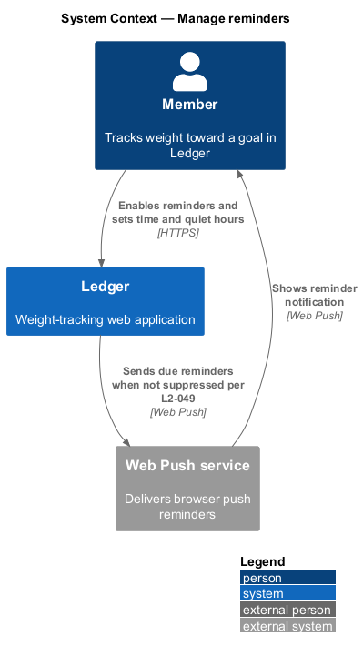
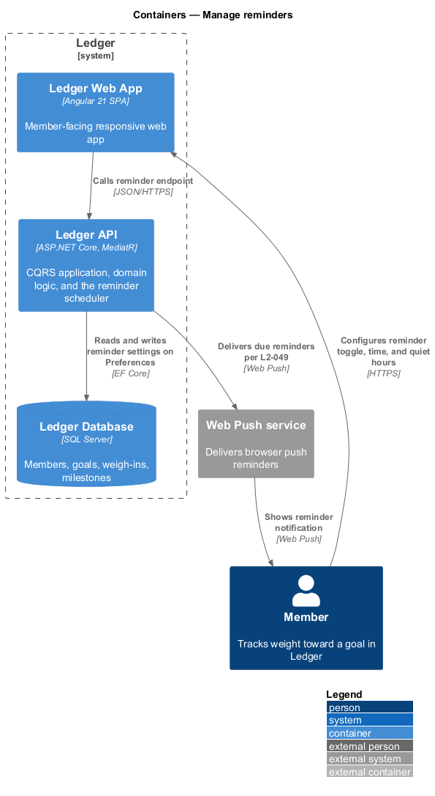
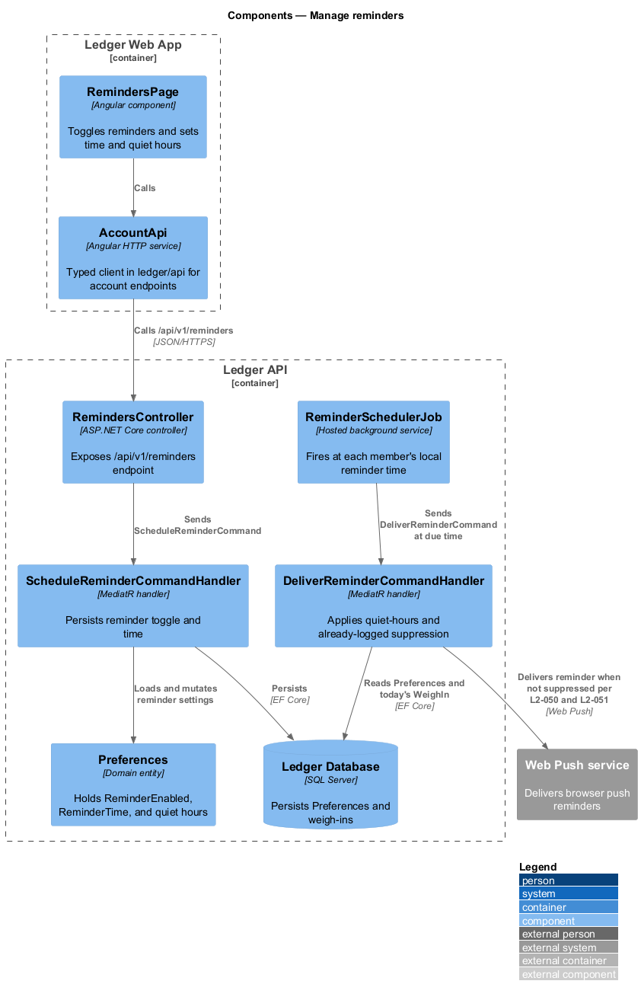
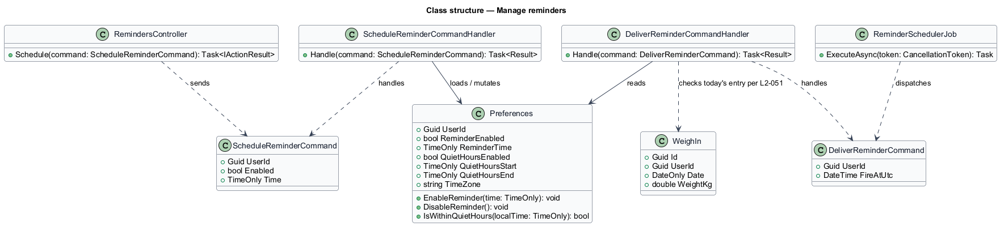
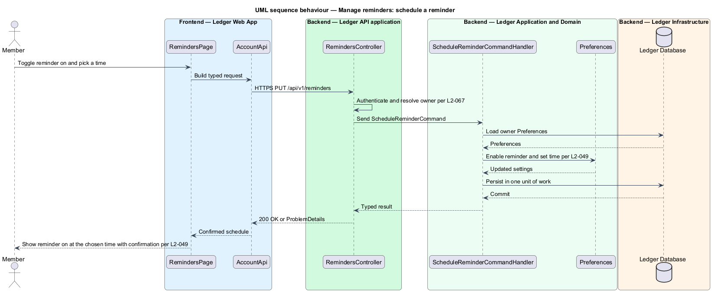
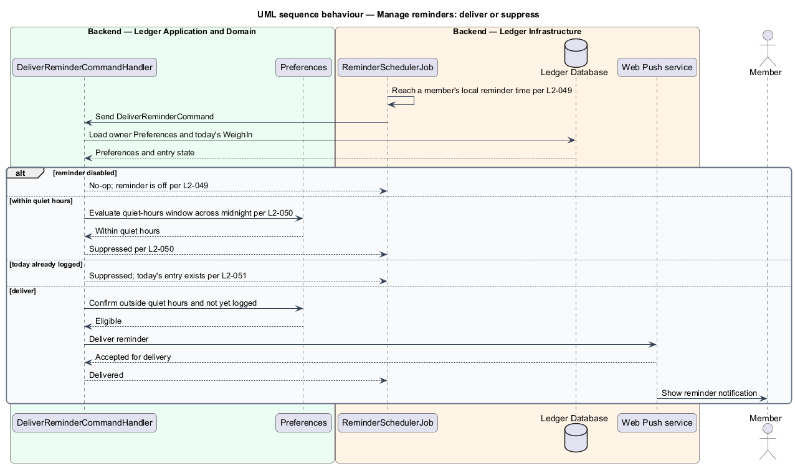

# Manage reminders

## Overview

Ledger is a responsive web application for weight tracking. A daily weigh-in is
the core habit the app supports, and a reminder helps the member keep it. This
feature covers configuring the daily reminder and delivering it — or suppressing
it — at the right moment.

*reminder* — a scheduled prompt that invites the member to log a weigh-in at a
chosen local time

*quiet hours* — a member-defined window during which reminders are suppressed

The member enables the reminder and picks a time; the setting persists on the
member's `Preferences`. A background scheduler fires at each member's local
reminder time and evaluates two suppression rules before delivery: the reminder
is suppressed inside quiet hours, and it is suppressed when today's weight is
already logged. A reminder that survives both rules is delivered through the web
push channel. Quiet-hours windows that span midnight shall be evaluated
correctly across the day boundary.

This document assumes no prior knowledge of Ledger's internals. Terms are
defined at first use, and the diagrams show where each part lives.

## Description

The feature is a vertical slice with two behaviours: configuring the reminder
from the UI, and a server-side scheduled evaluation that delivers or suppresses.

- **`RemindersPage`** — Angular component in the Ledger Web App. It presents the
  reminder toggle, the time picker, and the quiet-hours window.
- **`AccountApi`** — typed Angular HTTP client in the `ledger/api` library. It
  builds the reminder request and returns a typed result to the page.
- **`RemindersController`** — ASP.NET Core controller in the Ledger API. It
  exposes the `/api/v1/reminders` endpoint, authenticates the caller, resolves
  the owner, and dispatches the command.
- **`ScheduleReminderCommand`** — request object carrying the `UserId`, the
  `Enabled` toggle, and the reminder `Time`.
- **`ScheduleReminderCommandHandler`** — MediatR handler that loads the owner
  `Preferences`, applies the toggle and time, and persists them in one unit of
  work.
- **`ReminderSchedulerJob`** — hosted background service that reaches each
  member's local reminder time and dispatches a delivery command.
- **`DeliverReminderCommand`** — request object identifying the member and the
  fire time to evaluate.
- **`DeliverReminderCommandHandler`** — MediatR handler that reads the member's
  `Preferences` and today's `WeighIn`, applies the quiet-hours and already-logged
  suppression rules, and either delivers or suppresses.
- **`Preferences`** — domain entity holding `ReminderEnabled`, `ReminderTime`,
  the quiet-hours window, and the member's timezone.
- **Web Push service** — external system that delivers the browser push reminder.

## Requirements

The feature realizes the following level-2 (L2) requirements. Each L2 refines a
level-1 (L1) requirement, cited by identifier.

| L2 ID | Refines (L1) | Requirement |
|-------|--------------|-------------|
| `L2-049` | `L1-011` | Users enable a daily reminder at a chosen time. |
| `L2-050` | `L1-011` | Users mute reminders during a window. |
| `L2-051` | `L1-011` | Reminders never nag when the day is done. |

## Diagrams

### System context

The member configures reminders through Ledger, which delivers due reminders
through an external web push service when they are not suppressed.

### Containers

The configuration travels from the Ledger Web App to the Ledger API, which
persists reminder settings in the Ledger Database; a scheduler in the API
delivers due reminders through the web push service.

### Components

Inside the Ledger API, `RemindersController` dispatches `ScheduleReminderCommand`
to persist settings, while `ReminderSchedulerJob` dispatches `DeliverReminderCommand`
to the handler that applies suppression and delivers.

### Class structure

`ScheduleReminderCommandHandler` mutates `Preferences`; `ReminderSchedulerJob`
dispatches `DeliverReminderCommand`, whose handler reads `Preferences` and the
day's `WeighIn` to decide delivery.

### Behaviour — schedule a reminder

The handler enables the reminder and sets the time per `L2-049`, persists the
change, and the UI confirms the new schedule.

### Behaviour — deliver or suppress

At the local reminder time the handler suppresses inside quiet hours per `L2-050`
and when today is already logged per `L2-051`, and otherwise delivers through the
web push service.

