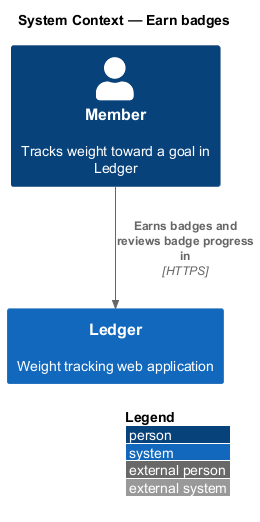
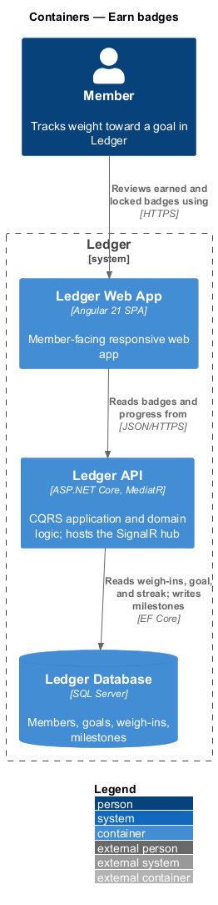
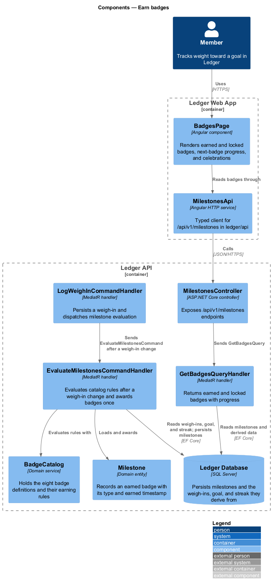
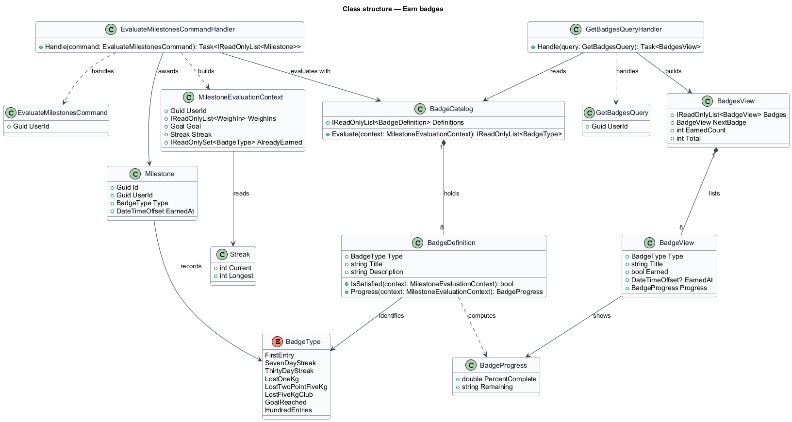
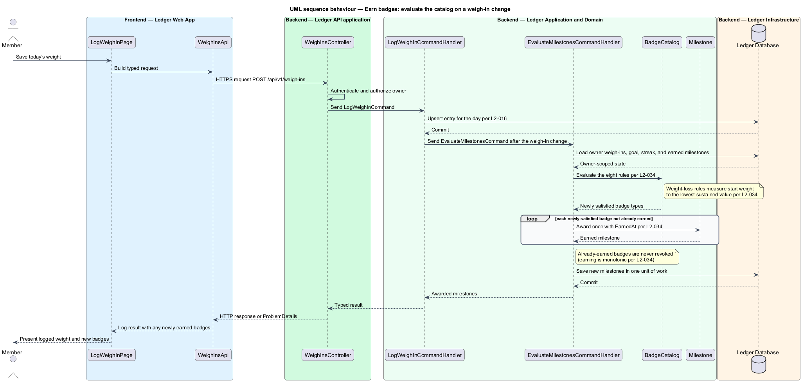
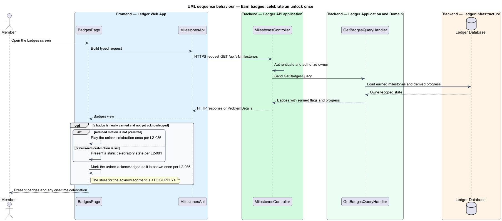

# Earn badges

## Overview

Ledger is a responsive web application for weight tracking. A member sets a goal
weight and target date, logs a daily weigh-in, and reads the trend toward the
goal. This feature recognizes that progress by awarding badges and presenting how
far the member stands from the next one.

**badge** — recognition granted once when a member's tracking data satisfies a
defined rule

**badge catalog** — fixed set of eight badge definitions, each pairing a badge
with the rule that earns it

**milestone** — persisted record that a member earned a badge, carrying the badge
type and the moment it was earned

The catalog holds eight badges: First entry, 7-day streak, 30-day streak, −1 kg,
−2.5 kg, −5 kg club, Goal reached, and 100 entries. Ledger awards a badge at most
once and stamps it with the time it was earned. Earning is monotonic: once a badge
is earned it remains earned, and a later edit or deletion of a weigh-in shall not
revoke it, though a newly satisfied badge is awarded on re-evaluation.

Evaluation reacts to weigh-in changes rather than running on a timer. When a member
logs, edits, or deletes a weigh-in, the application evaluates each catalog rule
against the member's current data and awards any badge whose rule is newly
satisfied. The weight-loss badges (−1 kg, −2.5 kg, −5 kg club) measure the drop
from the start weight to the lowest sustained value per the badge definition.

The badges screen presents every badge as earned or locked. An earned badge shows
its earned indicator; a locked badge shows the amount still required, and the badge
closest to completion is highlighted with its progress. When a badge is newly
earned, the screen announces it with a celebration once and does not repeat the
celebration on later visits. Where a member prefers reduced motion, a static
celebratory state replaces the animation.

This document assumes no prior knowledge of Ledger's internals. The terms above are
defined at first use, and the diagrams show where each part lives.

## Description

The feature is a vertical slice that runs from the badges screen to the database,
plus an evaluation step that reacts to weigh-in changes.

- **`BadgesPage`** — Angular page component in `ledger/components`. It renders the
  earned and locked badges, the next-badge progress ring (L2-037), the overall
  earned count, and the one-time unlock celebration (L2-036, L2-081).
- **`MilestonesApi`** — typed Angular HTTP client in `ledger/api`. It calls the
  `/api/v1/milestones` endpoint and returns a typed badges view to the page.
- **`MilestonesController`** — ASP.NET Core controller in the Ledger API. It exposes
  the `/api/v1/milestones` endpoints, authenticates the caller, authorizes the
  owner, and dispatches `GetBadgesQuery`.
- **`GetBadgesQuery`** — the read request carrying the owner's `UserId`.
- **`GetBadgesQueryHandler`** — MediatR handler that combines the catalog with the
  owner's earned milestones, computes each locked badge's remaining progress, and
  selects the nearest unearned badge (L2-037).
- **`EvaluateMilestonesCommand`** — the request to evaluate the catalog for an
  owner, carrying the `UserId`. A weigh-in change dispatches it.
- **`EvaluateMilestonesCommandHandler`** — MediatR handler that loads the owner's
  weigh-ins, goal, streak, and earned milestones, evaluates the catalog, and awards
  each newly satisfied badge once in one unit of work (L2-034).
- **`BadgeCatalog`** — domain service holding the eight `BadgeDefinition` entries
  and their earning rules. It evaluates a `MilestoneEvaluationContext` and returns
  the badge types the data satisfies.
- **`BadgeDefinition`** — one badge's type, display text, and rule. Its
  `IsSatisfied` tests the rule and its `Progress` reports how much remains.
- **`MilestoneEvaluationContext`** — the owner-scoped data a rule reads: the
  weigh-ins, the goal, the current streak, and the set of already-earned badges.
- **`Milestone`** — domain entity recording one earned badge with its `Type` and
  `EarnedAt`. It is owner-scoped and awarded at most once per type.
- **`BadgeType`** — enumeration of the eight badge types in the catalog.
- **`Streak`** — value holding the member's `Current` and `Longest` streak, read by
  the streak badges. Its computation is described in the `track-streaks` feature.
- **`Ledger Database`** — SQL Server store. It persists milestones and holds the
  weigh-ins, goal, and streak the evaluation reads.

Evaluation and the earning rules live in the Application and Domain layers, not in
the controller or the client, so a weigh-in logged from any surface earns the same
badges. The celebration is shown once per newly earned badge; the store that records
the acknowledgment is `<TO SUPPLY>`.

## Requirements

The feature realizes the following level-2 (L2) requirements. Each L2 requirement
refines a level-1 (L1) requirement, cited by identifier.

| L2 ID | Refines (L1) | Requirement |
|-------|--------------|-------------|
| `L2-034` | `L1-007` | Badges are awarded for defined achievements. |
| `L2-036` | `L1-007` | Unlocking a badge or reaching the goal is celebrated. |
| `L2-037` | `L1-007` | The nearest unearned badge shows progress. |
| `L2-081` | `L1-018` | Visual accessibility is respected. |

## Diagrams

### System context

The member earns badges and reviews badge progress in Ledger. No external system
takes part in earning a badge.

### Containers

The member reviews badges in the Ledger Web App, which reads badges and progress
from the Ledger API. The API reads weigh-ins, goal, and streak from the Ledger
Database and writes milestones to it.

### Components

Inside the Ledger API, `MilestonesController` dispatches `GetBadgesQuery` for the
read path, while `LogWeighInCommandHandler` dispatches `EvaluateMilestonesCommand`
after a weigh-in change. The evaluation handler reads the catalog rules through
`BadgeCatalog` and awards `Milestone` records.

### Class structure

`BadgeCatalog` composes eight `BadgeDefinition` entries keyed by `BadgeType`.
`EvaluateMilestonesCommandHandler` builds a `MilestoneEvaluationContext`, evaluates
it against the catalog, and awards `Milestone` records. `GetBadgesQueryHandler`
reads the catalog to build a `BadgesView` of earned and locked `BadgeView` items.

### Behaviour — evaluate the catalog on a weigh-in change

After the weigh-in is upserted, `LogWeighInCommandHandler` dispatches
`EvaluateMilestonesCommand`. The evaluation handler loads owner-scoped state,
evaluates the eight rules (L2-034), awards each newly satisfied badge once, and
leaves already-earned badges intact because earning is monotonic (L2-034).

### Behaviour — celebrate an unlock once

When the badges screen loads a view that contains a newly earned, unacknowledged
badge, `BadgesPage` announces it once. The `alt` distinguishes the animated
celebration (L2-036) from the static celebratory state shown when reduced motion is
preferred (L2-081); the unlock is then marked acknowledged so it is not repeated.

