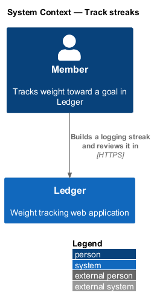
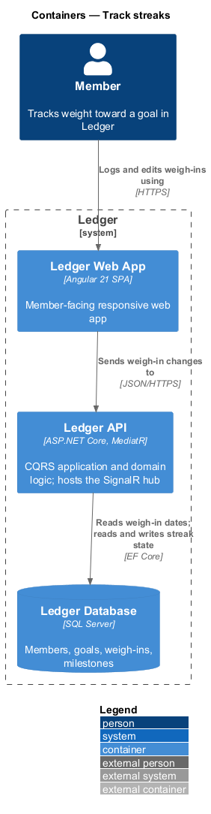
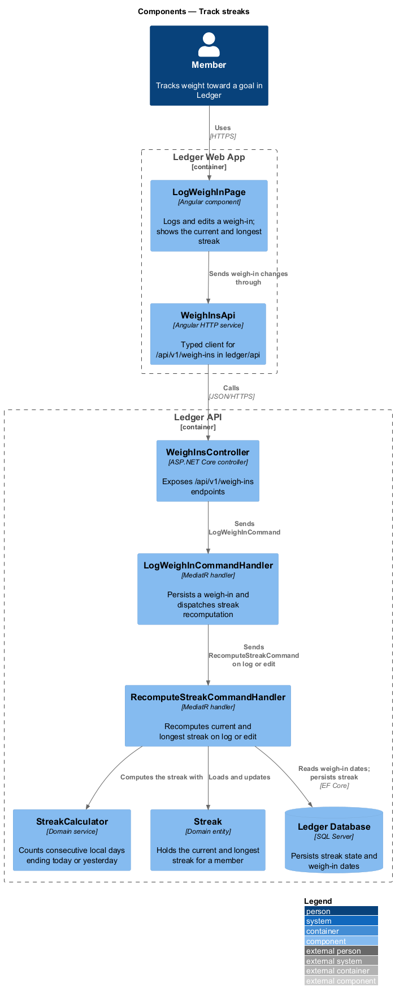
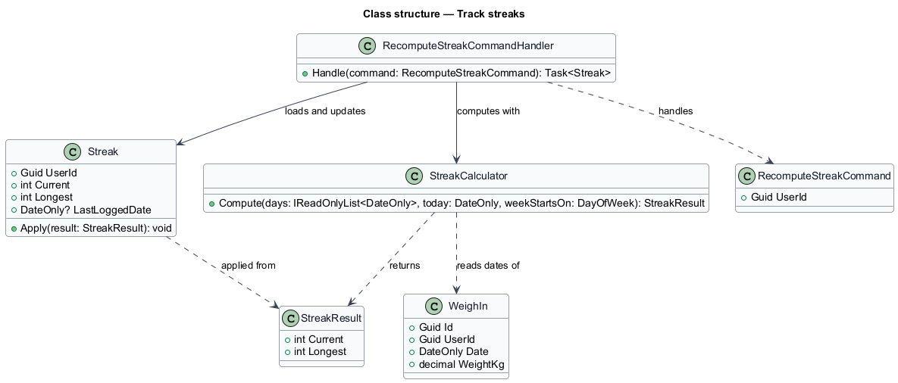
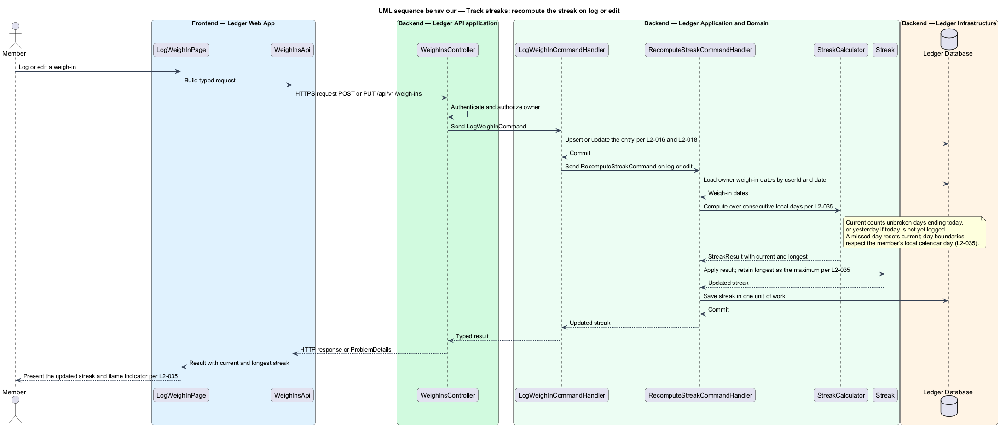

# Track streaks

## Overview

Ledger is a responsive web application for weight tracking. A member sets a goal
weight and target date and logs a daily weigh-in. This feature rewards the habit of
logging by tracking how many days in a row the member records a weigh-in.

**streak** — count of consecutive local calendar days on each of which the member
recorded a weigh-in

**current streak** — length of the unbroken run of logged days ending today, or
ending yesterday when today is not yet logged

**longest streak** — greatest current streak the member has reached, retained across
resets

The streak is recomputed when the underlying data changes, not on a timer. When a
member logs a new weigh-in or edits an existing one, the application recomputes the
current and longest streak from the member's weigh-in dates. Consecutive days are
counted over the member's local calendar day, so the day boundary respects the
member's timezone and configured week start (L2-035).

A missed day resets the current streak while the longest streak is preserved. The
current streak counts the unbroken run of days ending today; when today is not yet
logged, it counts the run ending yesterday, so a member who has not yet logged today
does not see the streak drop prematurely (L2-035). The badges screen presents the
current streak, the longest streak, and a per-day flame indicator, and the streak
also appears among the dashboard mini-stats.

This document assumes no prior knowledge of Ledger's internals. The terms above are
defined at first use, and the diagram shows where each part lives.

## Description

The feature is a vertical slice whose active behaviour runs on the write path: a
weigh-in change triggers a recomputation that persists updated streak state.

- **`LogWeighInPage`** — Angular page component in `ledger/components`. It logs and
  edits a weigh-in and displays the current and longest streak with the flame
  indicator (L2-035).
- **`WeighInsApi`** — typed Angular HTTP client in `ledger/api`. It sends the
  weigh-in change to `/api/v1/weigh-ins` and returns a typed result to the page.
- **`WeighInsController`** — ASP.NET Core controller in the Ledger API. It exposes
  the `/api/v1/weigh-ins` endpoints, authenticates the caller, authorizes the owner,
  and dispatches the weigh-in command.
- **`LogWeighInCommandHandler`** — MediatR handler that persists the weigh-in and,
  once it is committed, dispatches `RecomputeStreakCommand`.
- **`RecomputeStreakCommand`** — the request to recompute an owner's streak,
  carrying the `UserId`.
- **`RecomputeStreakCommandHandler`** — MediatR handler that loads the owner's
  weigh-in dates, computes the streak, applies the result to the `Streak`, and
  persists it in one unit of work.
- **`StreakCalculator`** — domain service that counts consecutive local days over an
  ordered set of weigh-in dates, resolving the current and longest streak (L2-035).
- **`Streak`** — domain entity holding the member's `Current` and `Longest` streak
  and the `LastLoggedDate`. Its `Apply` updates the current streak and retains the
  longest as the maximum of the prior longest and the new current (L2-035).
- **`StreakResult`** — value carrying the computed `Current` and `Longest` returned
  by the calculator.
- **`WeighIn`** — domain entity whose `Date` supplies the days the calculator reads.
- **`Ledger Database`** — SQL Server store. It holds the weigh-in dates the
  calculator reads and persists the streak state.

The counting rule lives in the Domain layer in `StreakCalculator`, and the
recomputation is orchestrated in the Application layer, so any surface that logs or
edits a weigh-in updates the streak the same way. The streak read model is consumed
by the badges screen and the dashboard; those read paths are described in their own
feature designs.

## Requirements

The feature realizes the following level-2 (L2) requirement, which refines a level-1
(L1) requirement, cited by identifier.

| L2 ID | Refines (L1) | Requirement |
|-------|--------------|-------------|
| `L2-035` | `L1-007` | The system tracks logging streaks. |

## Diagrams

### System context

The member builds a logging streak and reviews it in Ledger. No external system
takes part in tracking a streak.

### Containers

The member logs and edits weigh-ins in the Ledger Web App, which sends each change
to the Ledger API. The API reads weigh-in dates from the Ledger Database and reads
and writes streak state there.

### Components

Inside the Ledger API, `LogWeighInCommandHandler` dispatches `RecomputeStreakCommand`
after a weigh-in change. `RecomputeStreakCommandHandler` computes the streak through
`StreakCalculator` and updates the `Streak` entity.

### Class structure

`RecomputeStreakCommandHandler` computes a `StreakResult` with `StreakCalculator`
from the owner's `WeighIn` dates and applies it to the `Streak` entity, which retains
the longest streak.

### Behaviour — recompute the streak on log or edit

After the weigh-in is committed, `LogWeighInCommandHandler` dispatches
`RecomputeStreakCommand`. The handler loads the owner's weigh-in dates, counts
consecutive local days ending today or yesterday (L2-035), applies the result to the
`Streak`, and commits it in one unit of work.

