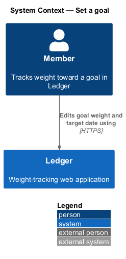
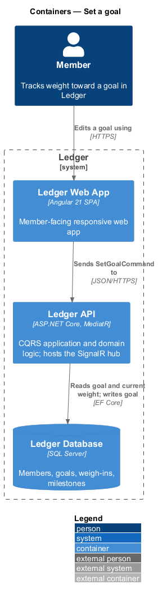
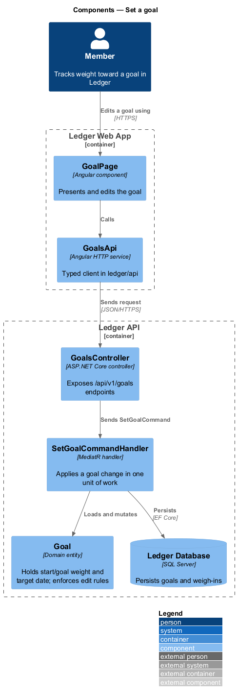
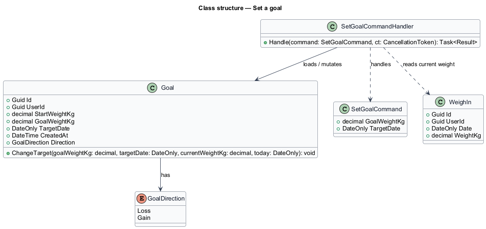
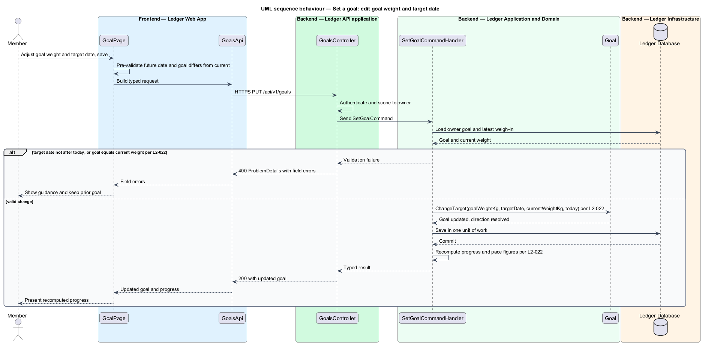

# Set a goal

## Overview

Ledger is a responsive web application for weight tracking. A member sets a goal
weight and a target date, logs a daily weigh-in, and reads the trend toward the
goal. This feature covers changing an established goal: its goal weight, its
target date, or both.

**goal** — target weight and target date a member works toward, measured from a
start weight

**goal direction** — orientation of a goal: *loss* when the goal weight is below
the start weight, *gain* when the goal weight is above the start weight

**current weight** — weight recorded on the member's most recent weigh-in

A member opens the goal screen, adjusts the goal weight and the target date, and
saves. The change is deliberate and validated. A target date shall be strictly
after the current day. A goal weight shall differ from the current weight. When
both rules hold, the `Goal` updates and every derived figure — progress
percentage, remaining amount, and pace projection — recomputes from the new
target.

Weight is stored canonically in kilograms to one decimal place; the display unit
(kilograms or pounds) is a per-member preference (L2-045). The start weight is
fixed when the goal baseline is created during onboarding (L2-011) and is not
changed by this feature; an edit changes the goal weight and the target date
only.

The progress and pace math holds for both goal directions. Loss and gain differ
only in sign, and the derived figures (L2-021, L2-023) read the direction from
the entity rather than assuming a downward goal (L2-022).

This document assumes no prior knowledge of Ledger's internals. The terms used
below are defined at first use, and the diagrams show where each part lives.

## Description

The feature is a vertical slice that runs from the goal screen to the database.

- **`GoalPage`** — Angular component in the Ledger Web App. It presents the
  current goal, offers editable goal-weight and target-date controls, and shows
  validation feedback inline.
- **`GoalsApi`** — typed Angular HTTP client in the `ledger/api` library. It
  builds the request for the goal endpoint and returns a typed result to the
  page.
- **`GoalsController`** — ASP.NET Core controller in the Ledger API. It exposes
  the `/api/v1/goals` endpoints, authenticates the caller, scopes the request to
  the owner, and dispatches the command.
- **`SetGoalCommand`** — request object carrying the new `GoalWeightKg` and
  `TargetDate`.
- **`SetGoalCommandHandler`** — MediatR handler holding the application logic. It
  loads the owner's `Goal` and current weight, applies the change, and persists
  it in one unit of work.
- **`Goal`** — domain entity holding `StartWeightKg`, `GoalWeightKg`,
  `TargetDate`, and `CreatedAt`. Its `ChangeTarget` method enforces the
  future-date and goal-differs-from-current rules and derives the goal direction.
- **`GoalDirection`** — enumeration of goal orientation: `Loss`, `Gain`.
- **`WeighIn`** — dated weight entry; the most recent one supplies the current
  weight against which the goal-differs-from-current rule is checked.

The future-date rule and the goal-differs-from-current rule apply on both client
and server. `GoalPage` blocks an invalid save for immediate feedback;
`SetGoalCommandHandler` re-checks each rule server-side so validation holds
independent of the client (L2-068). A rejected change leaves the prior goal
intact and returns field-level errors in the problem envelope (L2-088).

## Requirements

The feature realizes the following level-2 (L2) requirement, which refines a
level-1 (L1) requirement cited by identifier.

| L2 ID | Refines (L1) | Requirement |
|-------|--------------|-------------|
| `L2-022` | `L1-004` | The user changes goal weight and/or target date. |

## Diagrams

### System context

The member edits a goal through Ledger. No external system participates in a
goal change.

### Containers

The change travels from the Ledger Web App to the Ledger API, which reads the
current goal and weight and writes the updated goal to the Ledger Database.

### Components

Inside the Ledger API, `GoalsController` dispatches `SetGoalCommand` to
`SetGoalCommandHandler`, which mutates the `Goal` entity and persists it.

### Class structure

`SetGoalCommandHandler` handles `SetGoalCommand`, loads and mutates `Goal`, and
reads the latest `WeighIn` for the current weight; `Goal` holds a
`GoalDirection`.

### Behaviour — edit a goal

`GoalsController` authenticates and scopes the request to the owner, then
dispatches the command. The handler rejects a non-future target date and a goal
equal to the current weight through an `alt` branch (L2-022); on a valid change
it applies `ChangeTarget`, commits in one unit of work, and the derived progress
and pace figures recompute.

