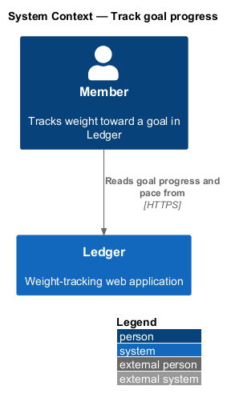
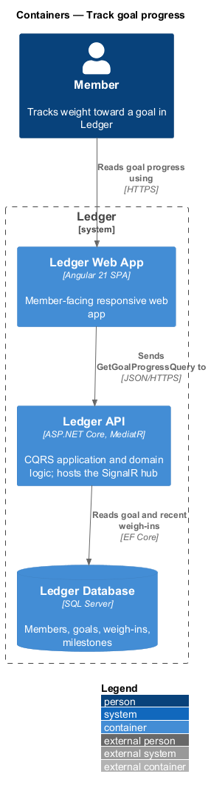
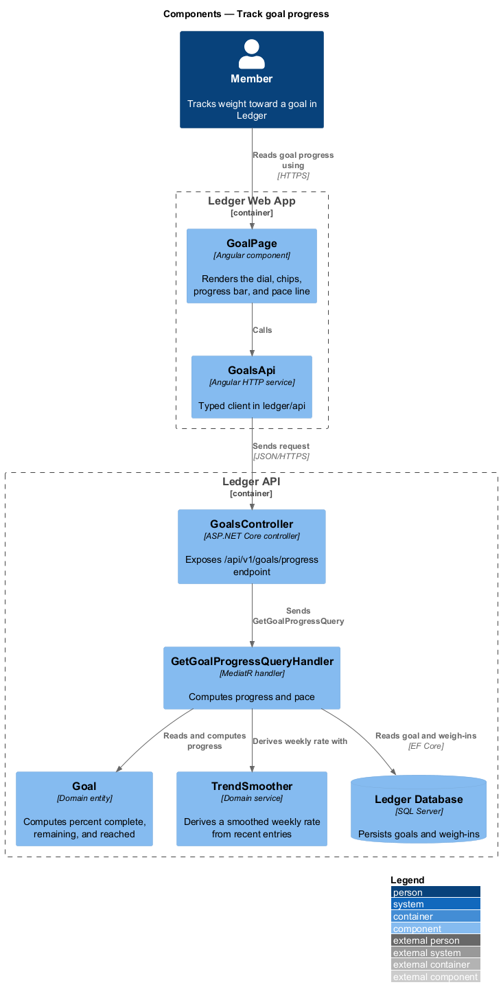
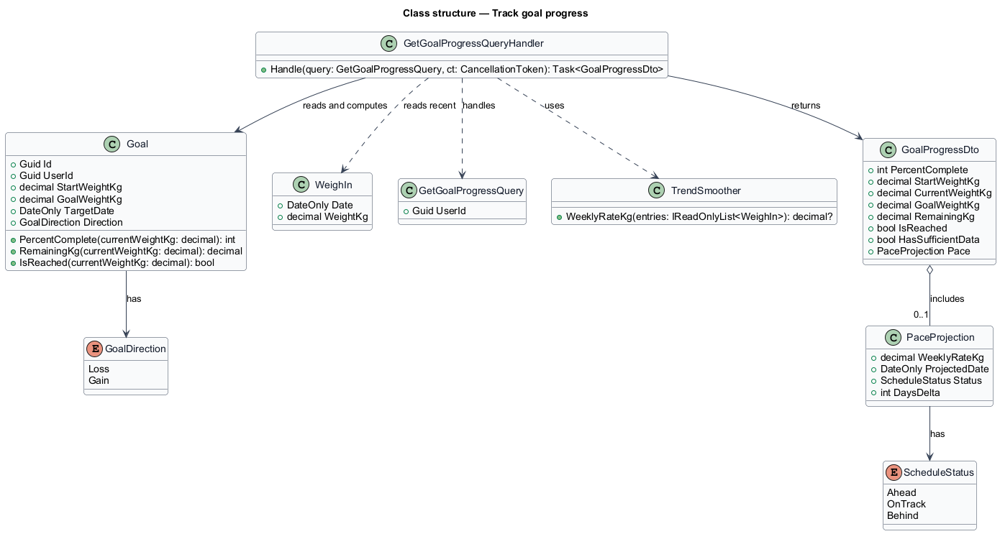
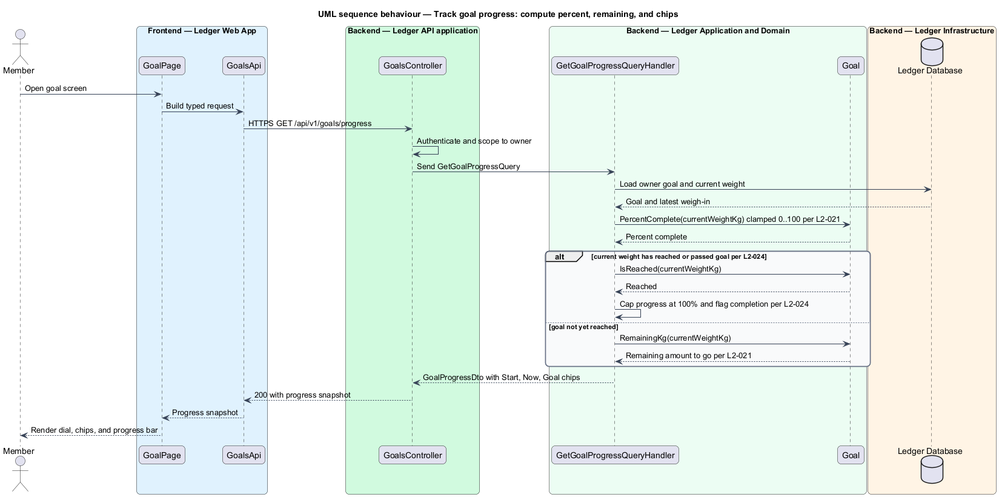
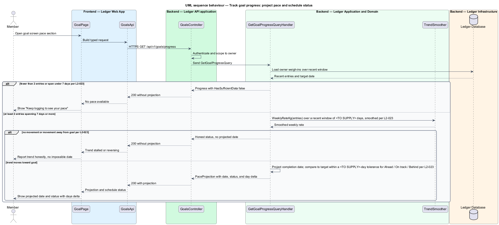

# Track goal progress

## Overview

Ledger is a responsive web application for weight tracking. A member sets a goal
weight and a target date, logs a daily weigh-in, and reads the trend toward the
goal. This feature covers what the member reads on the goal screen: how far the
journey has come, and when the goal is projected to arrive.

**percent complete** — clamp to the range 0–100 of the ratio
(start weight − current weight) / (start weight − goal weight)

**remaining amount** — weight still to change to reach the goal weight

**pace** — smoothed recent rate of weight change per week

**projected completion date** — date at which the goal weight is reached if the
current pace holds

**schedule status** — relation of the projected completion date to the target
date: *ahead of schedule*, *on track*, or *behind schedule*

The feature computes two things. Progress covers the percent complete, the
remaining amount, and the Start, Now, and Goal chips (L2-021). Pace covers the
smoothed weekly rate, the projected completion date, and the schedule status
(L2-023). Progress is available once a goal and at least one weigh-in exist. Pace
requires at least two entries spanning at least seven days; with less, a neutral
"Keep logging to see your pace" message is shown in place of a projection
(L2-023).

The percent-complete formula holds for both goal directions. For a loss goal the
start weight is above the goal weight; for a gain goal it is below. Because the
numerator and denominator change sign together, the ratio stays non-negative in
both cases, so the same formula serves loss and gain without a separate branch
(L2-022, L2-024).

Reaching the goal is recognized explicitly. When a weigh-in crosses the goal
weight, the goal is marked reached, progress caps at 100% rather than showing a
negative remaining value, and the goal-reached badge (L2-034) becomes eligible
(L2-024).

This document assumes no prior knowledge of Ledger's internals. The terms used
below are defined at first use, and the diagrams show where each part lives.

## Description

The feature is a read-only vertical slice that runs from the goal screen to the
database.

- **`GoalPage`** — Angular component in the Ledger Web App. It renders the
  progress dial, the Start/Now/Goal chips, the progress bar, and the pace line.
- **`GoalsApi`** — typed Angular HTTP client in the `ledger/api` library. It
  requests the progress snapshot and returns a typed result to the page.
- **`GoalsController`** — ASP.NET Core controller in the Ledger API. It exposes
  the `/api/v1/goals/progress` endpoint, authenticates the caller, scopes the
  request to the owner, and dispatches the query.
- **`GetGoalProgressQuery`** — request object for the owner's progress snapshot.
- **`GetGoalProgressQueryHandler`** — MediatR handler holding the read logic. It
  loads the owner's `Goal` and recent `WeighIn` entries, computes progress and
  pace, and returns a `GoalProgressDto`.
- **`Goal`** — domain entity holding `StartWeightKg`, `GoalWeightKg`, and
  `TargetDate`. Its `PercentComplete`, `RemainingKg`, and `IsReached` methods
  compute progress for either direction.
- **`TrendSmoother`** — domain service that derives a smoothed weekly rate of
  change from the entries within a recent window of `<TO SUPPLY>` days, rather
  than from two raw points (L2-023).
- **`PaceProjection`** — value carrying the weekly rate, the projected completion
  date, the schedule status, and the day delta against the target date.
- **`GoalProgressDto`** — result carrying the percent complete, the Start, Now,
  and Goal values, the remaining amount, the reached flag, the sufficient-data
  flag, and the optional pace projection.
- **`GoalDirection`** — enumeration of goal orientation: `Loss`, `Gain`.
- **`ScheduleStatus`** — enumeration of schedule outcome: `Ahead`, `OnTrack`,
  `Behind`.
- **`WeighIn`** — dated weight entry; the most recent one supplies the current
  weight, and the recent window feeds the trend smoother.

The schedule status compares the projected completion date to the target date.
It reads *on track* when the projection falls within a tolerance band of
`<TO SUPPLY>` days of the target date, *ahead of schedule* when the projection is
earlier, and *behind schedule* when it is later (L2-023).

The handler returns pace only when the data is sufficient and the recent trend
moves toward the goal. When the trend shows no movement or movement away from the
goal, the handler reports the honest status rather than a projected date that
would never arrive (L2-023). When fewer than two entries exist or the span is
under seven days, `HasSufficientData` is false and `PaceProjection` is absent.

## Requirements

The feature realizes the following level-2 (L2) requirements. Each L2 requirement
refines a level-1 (L1) requirement, cited by identifier.

| L2 ID | Refines (L1) | Requirement |
|-------|--------------|-------------|
| `L2-021` | `L1-004` | The goal screen shows progress toward the goal weight. |
| `L2-023` | `L1-004` | The system projects a completion date and reports schedule status. |
| `L2-024` | `L1-004` | Reaching the goal is recognized explicitly. |

## Diagrams

### System context

The member reads goal progress through Ledger. No external system participates
in the computation.

### Containers

The request travels from the Ledger Web App to the Ledger API, which reads the
goal and recent weigh-ins from the Ledger Database and returns a computed
snapshot.

### Components

Inside the Ledger API, `GoalsController` dispatches `GetGoalProgressQuery` to
`GetGoalProgressQueryHandler`, which reads the `Goal` entity, applies the
`TrendSmoother`, and returns a `GoalProgressDto`.

### Class structure

`GetGoalProgressQueryHandler` handles `GetGoalProgressQuery`, reads `Goal` and
recent `WeighIn` entries, uses `TrendSmoother`, and returns a `GoalProgressDto`
that carries an optional `PaceProjection`.

### Behaviour — compute goal progress

The handler computes the clamped percent complete and the remaining amount from
the goal and the current weight, caps progress at 100% when the goal is reached
(L2-024), and returns the Start, Now, and Goal chips (L2-021).

### Behaviour — project pace and schedule status

The handler derives a smoothed weekly rate from the recent trend, projects a
completion date, and reports schedule status. An `alt` branch handles
insufficient data and a stalled or reversing trend, so the screen never shows a
misleading projection (L2-023).

