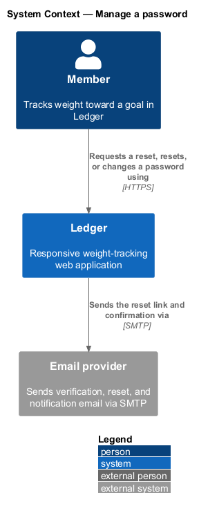
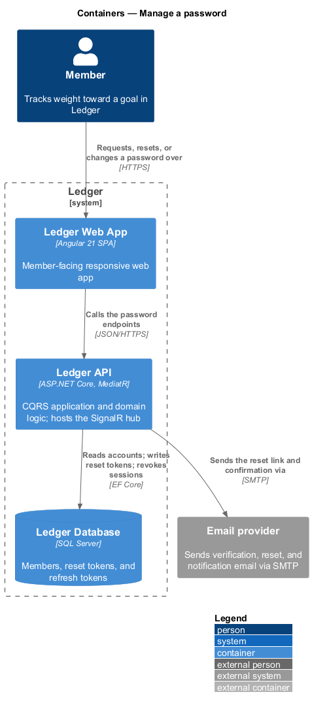
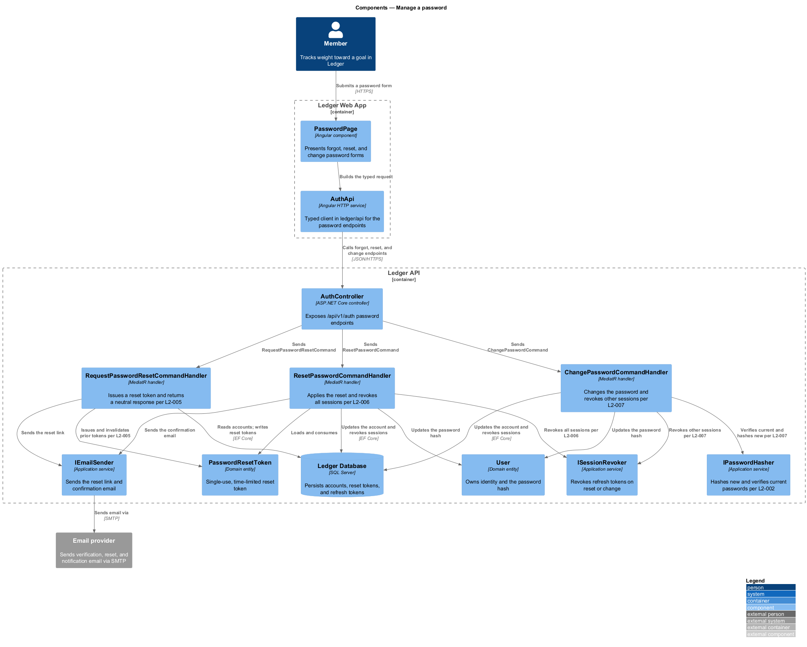
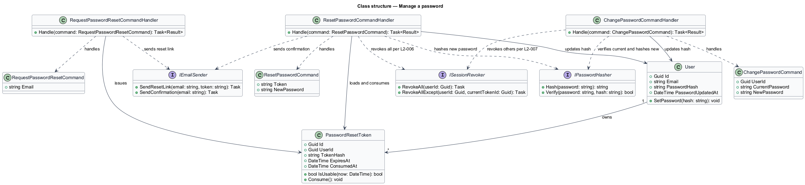
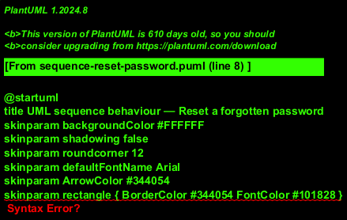
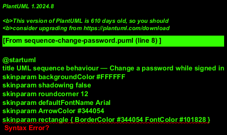

# Manage a password

## Overview

Ledger is a responsive web application for weight tracking. A *member* manages
the password that secures the account in three ways: requesting a reset link
after forgetting it, completing a reset with the emailed token, and changing the
password while signed in. This feature covers all three.

*Forgot-password request* — a request that a reset link be sent to an email
address. The response is neutral: the same confirmation is shown whether or not
an account exists, so the flow reveals nothing about which addresses are
registered.

*Password reset* — completion of a reset using a single-use, time-limited token.
A successful reset revokes every existing session and directs the member to sign
in again.

*Password change* — replacement of the password by a signed-in member who
confirms the current password. A successful change revokes other active
sessions while the current session remains valid.

This document assumes no prior knowledge of Ledger's internals. Terms are
defined at first use, and the diagrams show where each part lives.

## Description

The feature is a vertical slice that runs from the password screens to the
database and the email provider.

- **`PasswordPage`** — Angular component in the Ledger Web App. It presents the
  forgot-password, reset, and change forms with the password policy meter.
- **`AuthApi`** — typed Angular HTTP service in the `ledger/api` library. It
  builds the forgot, reset, and change requests and returns typed results.
- **`AuthController`** — ASP.NET Core controller in the Ledger API. It exposes
  the forgot-password, reset-password, and change-password endpoints, applies
  rate limiting, authenticates the change request, and dispatches the commands.
- **`RequestPasswordResetCommand`** — the request object carrying the `Email`.
- **`RequestPasswordResetCommandHandler`** — MediatR handler that issues a reset
  token, invalidates any prior token, sends the reset link, and returns a
  neutral result.
- **`ResetPasswordCommand`** — the request object carrying the `Token` and the
  `NewPassword`.
- **`ResetPasswordCommandHandler`** — MediatR handler that validates and
  consumes the token, updates the password hash, revokes all sessions, and sends
  a confirmation.
- **`ChangePasswordCommand`** — the request object carrying the owner `UserId`,
  the `CurrentPassword`, and the `NewPassword`.
- **`ChangePasswordCommandHandler`** — MediatR handler that verifies the current
  password, updates the hash, stamps the update time, and revokes other
  sessions.
- **`User`** — domain entity that owns identity, the password hash, and the
  `PasswordUpdatedAt` timestamp. Its `SetPassword(hash)` method applies a new
  hash.
- **`PasswordResetToken`** — entity that holds a hashed, single-use reset token,
  its expiry, and its consumption time. Its `IsUsable(now)` method rejects
  expired or used tokens.
- **`IPasswordHasher`** — application service that hashes new passwords and
  verifies the current one.
- **`IEmailSender`** — application service that sends the reset link and the
  confirmation notification.
- **`ISessionRevoker`** — application service that revokes refresh tokens, either
  all of them on reset or all except the current one on change.

A reset request never discloses account existence, and no password or hash value
appears in any response, email, or log.

## Requirements

The feature realizes the following level-2 (L2) requirements. Each L2
requirement refines a level-1 (L1) requirement, cited by identifier.

| L2 ID | Refines (L1) | Requirement |
|-------|--------------|-------------|
| `L2-005` | `L1-001` | A user who forgot their password can request a reset link. |
| `L2-006` | `L1-001` | A user completes a password reset using the emailed token. |
| `L2-007` | `L1-001` | A signed-in user changes their password by confirming the current one. |

## Diagrams

### System context

A member requests, resets, or changes a password through Ledger, which sends the
reset link and confirmation through an external email provider.

### Containers

The password forms travel from the Ledger Web App to the Ledger API, which
reads accounts, writes reset tokens, revokes sessions in the Ledger Database,
and requests email from the provider.

### Components

Inside the Ledger API, `AuthController` dispatches the three commands.
`RequestPasswordResetCommandHandler` issues a token and returns a neutral
response; `ResetPasswordCommandHandler` consumes the token, updates the hash, and
revokes all sessions; `ChangePasswordCommandHandler` verifies the current
password and revokes other sessions.

### Class structure

The three handlers share the `User` entity and the `IPasswordHasher`,
`IEmailSender`, and `ISessionRevoker` services. The reset handlers also load and
consume a `PasswordResetToken`.

### Behaviour — reset a forgotten password

The first fragment issues a single-use token (`L2-005`) and returns the neutral
confirmation regardless of account existence. The second fragment validates and
consumes the token (`L2-006`), updates the hash (`L2-002`), revokes all sessions,
and sends the confirmation; an invalid token returns an error with an option to
request a new link.

### Behaviour — change a password while signed in

`AuthController` authenticates the owner (`L2-067`) and dispatches the command.
The `alt` fragment separates an incorrect current password — which leaves
credentials unchanged (`L2-007`) — from the happy path, which updates the hash,
stamps `PasswordUpdatedAt`, revokes other sessions (`L2-007`), and audits the
change (`L2-072`).

