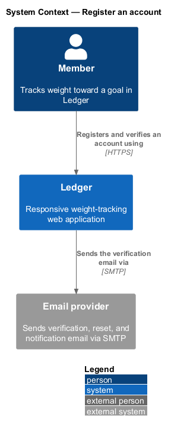
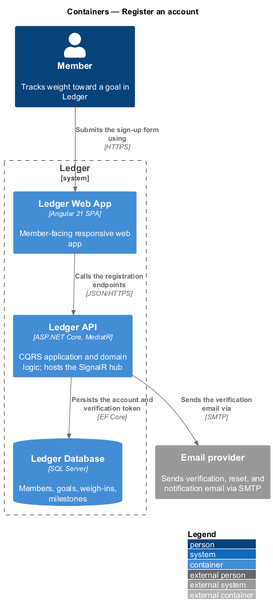
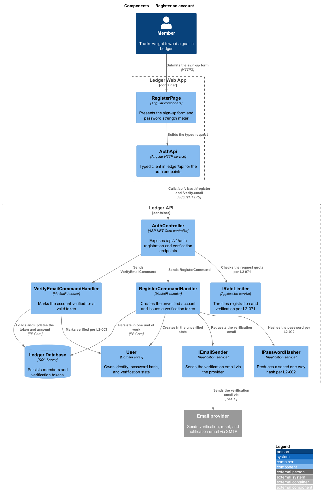
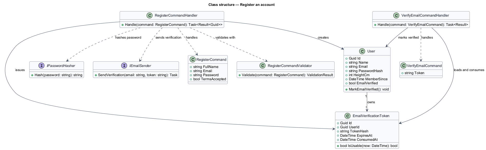
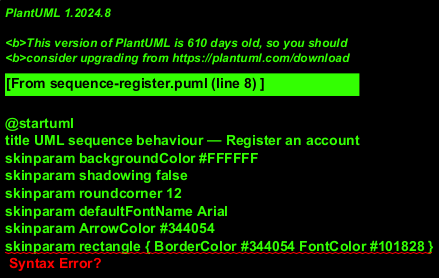
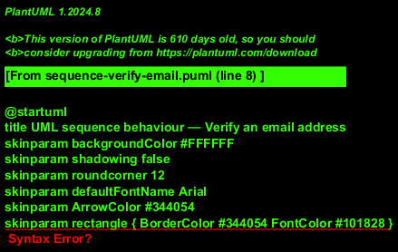

# Register an account

## Overview

Ledger is a responsive web application for weight tracking. A *member* is a
person who tracks weight toward a goal in Ledger. Before a member can log a
weigh-in, an account shall exist and its email address shall be verified. This
feature covers account creation and email verification: the entry point into
the identity-access subsystem.

*Registration* — creation of a member account from a full name, a unique email,
and a policy-compliant password, with explicit acceptance of the Terms of
Service and Privacy Policy. Registration produces an account in the *unverified*
state and issues a single-use verification token by email.

*Email verification* — transition of an account from unverified to verified
through a single-use, time-limited token delivered to the registered address. An
account remains unverified, and therefore not fully active, until the token is
consumed.

This document assumes no prior knowledge of Ledger's internals. Terms are
defined at first use, and the diagrams show where each part lives.

## Description

The feature is a vertical slice that runs from the sign-up screen to the
database and the email provider.

- **`RegisterPage`** — Angular component in the Ledger Web App. It presents the
  sign-up form, the live password strength meter, and the show/hide password
  toggle, and blocks submission until the terms are accepted.
- **`AuthApi`** — typed Angular HTTP service in the `ledger/api` library. It
  builds the registration and verification requests and returns typed results
  to the page.
- **`AuthController`** — ASP.NET Core controller in the Ledger API. It exposes
  the `/api/v1/auth/register` and `/api/v1/auth/verify-email` endpoints, applies
  rate limiting, validates input server-side, and dispatches the commands.
- **`RegisterCommand`** — the request object carrying `FullName`, `Email`,
  `Password`, and `TermsAccepted`.
- **`RegisterCommandHandler`** — MediatR handler holding the registration logic.
  It rejects a duplicate email, hashes the password, creates the account in the
  unverified state, issues a verification token, and persists both in one unit
  of work.
- **`VerifyEmailCommand`** — the request object carrying the verification
  `Token`.
- **`VerifyEmailCommandHandler`** — MediatR handler that loads the token, marks
  the account verified when the token is valid and unexpired, and consumes the
  token.
- **`User`** — domain entity that owns identity, the password hash, and the
  `EmailVerified` state. Its `MarkEmailVerified()` method enforces the
  verification transition.
- **`EmailVerificationToken`** — entity that holds a hashed, single-use token,
  its expiry, and its consumption time. Its `IsUsable(now)` method rejects
  expired or already-used tokens.
- **`IPasswordHasher`** — application service that produces a salted one-way
  hash from an approved algorithm.
- **`IEmailSender`** — application service that sends the verification email
  through the external provider.
- **`IRateLimiter`** — application service that throttles registration and
  verification requests per source and account.

The password is never stored, logged, or returned in any form other than a
salted one-way hash. Registration responses carry no password material.

## Requirements

The feature realizes the following level-2 (L2) requirements. Each L2
requirement refines a level-1 (L1) requirement, cited by identifier.

| L2 ID | Refines (L1) | Requirement |
|-------|--------------|-------------|
| `L2-001` | `L1-001` | A visitor creates an account with full name, email, and password, and must accept the Terms of Service and Privacy Policy. |
| `L2-002` | `L1-001` | Passwords must meet a strength policy and be stored using a slow, salted one-way hash. |
| `L2-003` | `L1-001` | New accounts must verify their email before the account is considered fully active. |
| `L2-068` | `L1-016` | All input is validated; all output is encoded. |
| `L2-071` | `L1-016` | Abusable endpoints are rate-limited. |

## Diagrams

### System context

A member registers and verifies an account through Ledger, which sends the
verification email through an external email provider.

### Containers

The sign-up form travels from the Ledger Web App to the Ledger API, which
persists the account and its verification token in the Ledger Database and
requests the verification email from the email provider.

### Components

Inside the Ledger API, `AuthController` applies rate limiting and validation,
then dispatches `RegisterCommand` and `VerifyEmailCommand`. The register handler
hashes the password, creates the `User`, issues an `EmailVerificationToken`, and
sends the email; the verify handler marks the account verified.

### Class structure

`RegisterCommandHandler` validates and handles `RegisterCommand`, hashes the
password through `IPasswordHasher`, creates a `User` and an
`EmailVerificationToken`, and sends the email through `IEmailSender`.
`VerifyEmailCommandHandler` consumes the token and marks the `User` verified.

### Behaviour — register an account

`AuthController` applies the rate limit (`L2-071`) and server-side validation
(`L2-068`), then dispatches `RegisterCommand`. The `alt` fragment separates the
email-already-in-use rejection (`L2-001`) from the happy path, which hashes the
password (`L2-002`), creates the unverified account, issues a token (`L2-003`),
and commits in one unit of work before sending the verification email.

### Behaviour — verify an email address

`VerifyEmailCommandHandler` loads the token by its hash. The `alt` fragment
separates a valid, unexpired token — which marks the account verified (`L2-003`)
and consumes the token — from an expired or used token, which returns a clear
error and offers to resend.

