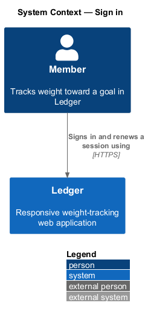
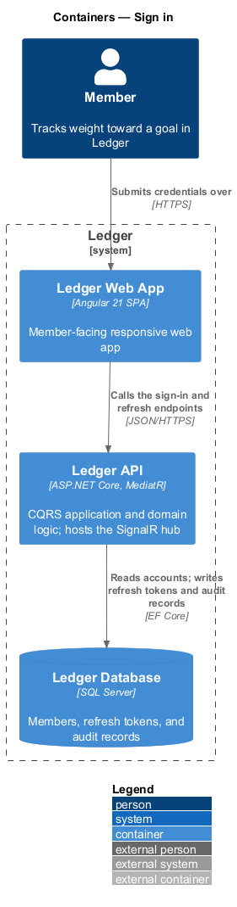
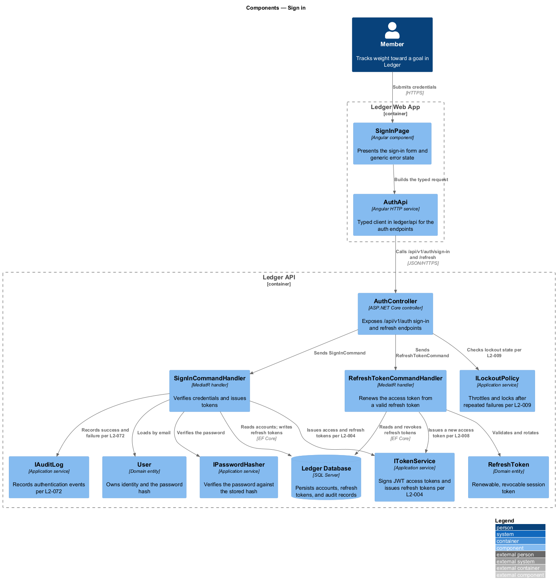
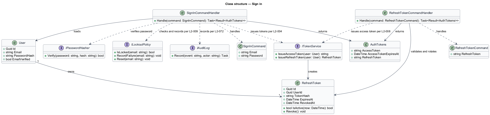
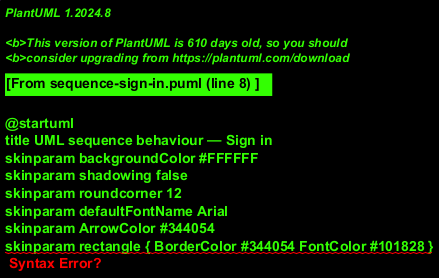
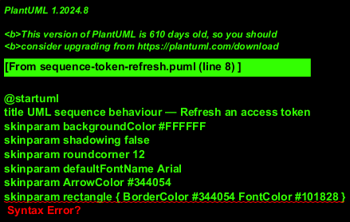

# Sign in

## Overview

Ledger is a responsive web application for weight tracking. A *member* signs in
to reach a personal dashboard and the rest of the application. This feature
covers credential-based sign-in, the tokens that carry a session, and the
protections that slow and lock repeated failures.

*Sign-in* — verification of an email and password against a stored account,
followed by issuance of a short-lived JSON Web Token (JWT) access token and a
refresh token. The access token authorizes protected requests; the refresh
token renews the access token without re-entering credentials.

*Lockout* — temporary refusal of further sign-in attempts after a configured
number of consecutive failures for an account or source, applied without
disclosing whether the account exists.

This document assumes no prior knowledge of Ledger's internals. Terms are
defined at first use, and the diagrams show where each part lives.

## Description

The feature is a vertical slice that runs from the sign-in screen to the
database.

- **`SignInPage`** — Angular component in the Ledger Web App. It presents the
  sign-in form and renders a single generic error for any credential failure.
- **`AuthApi`** — typed Angular HTTP service in the `ledger/api` library. It
  builds the sign-in and refresh requests and returns typed results to the page.
- **`AuthController`** — ASP.NET Core controller in the Ledger API. It exposes
  the `/api/v1/auth/sign-in` and `/api/v1/auth/refresh` endpoints, applies rate
  limiting, and dispatches the commands.
- **`SignInCommand`** — the request object carrying `Email` and `Password`.
- **`SignInCommandHandler`** — MediatR handler holding the sign-in logic. It
  checks lockout state, verifies the password, issues tokens, and records the
  outcome to the audit log.
- **`RefreshTokenCommand`** — the request object carrying the current refresh
  token.
- **`RefreshTokenCommandHandler`** — MediatR handler that validates a refresh
  token, rotates it, and issues a new access token.
- **`User`** — domain entity that owns identity and the password hash.
- **`RefreshToken`** — domain entity representing a renewable, revocable session
  token. Its `IsActive(now)` method rejects expired or revoked tokens.
- **`AuthTokens`** — result object carrying the access token, its expiry, and
  the refresh token.
- **`IPasswordHasher`** — application service that verifies a password against
  the stored hash.
- **`ITokenService`** — application service that signs JWT access tokens and
  issues refresh tokens.
- **`ILockoutPolicy`** — application service that tracks failures and reports
  lockout state.
- **`IAuditLog`** — application service that records authentication events.

The access token carries the user identifier and expiry and is signed with a
server-held secret; it holds no sensitive personal data beyond the identifier.
The refresh token is delivered as an httpOnly cookie and never appears in a URL.

## Requirements

The feature realizes the following level-2 (L2) requirements. Each L2
requirement refines a level-1 (L1) requirement, cited by identifier.

| L2 ID | Refines (L1) | Requirement |
|-------|--------------|-------------|
| `L2-004` | `L1-001` | Registered users sign in with email and password to receive a JWT access token. |
| `L2-008` | `L1-001` | Sessions must be renewable and revocable. |
| `L2-009` | `L1-001` | Repeated failed authentication must be slowed and locked. |
| `L2-069` | `L1-016` | Traffic and secrets are protected. |
| `L2-072` | `L1-016` | Security-relevant events are audit-logged. |

## Diagrams

### System context

A member signs in and renews a session through Ledger over HTTPS. Sign-in
involves no external system; the flow is contained within Ledger.

### Containers

Credentials travel from the Ledger Web App to the Ledger API, which reads the
account, and writes refresh tokens and audit records to the Ledger Database.

### Components

Inside the Ledger API, `AuthController` applies rate limiting and dispatches
`SignInCommand` and `RefreshTokenCommand`. `SignInCommandHandler` consults
`ILockoutPolicy`, verifies the password, issues tokens through `ITokenService`,
and records the outcome through `IAuditLog`; `RefreshTokenCommandHandler`
validates and rotates the `RefreshToken`.

### Class structure

`SignInCommandHandler` handles `SignInCommand`, loads the `User`, verifies the
password, checks `ILockoutPolicy`, and returns `AuthTokens` from `ITokenService`.
`RefreshTokenCommandHandler` validates and rotates a `RefreshToken` and returns
fresh `AuthTokens`.

### Behaviour — sign in

`AuthController` applies the rate limit (`L2-071` via the shared limiter), and
`SignInCommandHandler` checks lockout first (`L2-009`). Nested `alt` fragments
separate the locked-out response, the generic invalid-credentials response
(`L2-004`), and the happy path, which issues a JWT and refresh token (`L2-004`,
`L2-008`) and audits the outcome (`L2-072`).

### Behaviour — refresh an access token

`RefreshTokenCommandHandler` loads the refresh token and validates it. The `alt`
fragment separates a valid token — which rotates and reissues per `L2-008` — from
a revoked or expired token, which returns `401` and routes back to sign-in.

