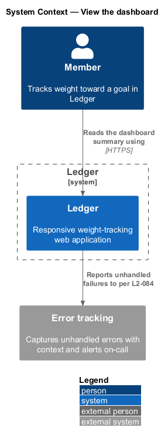
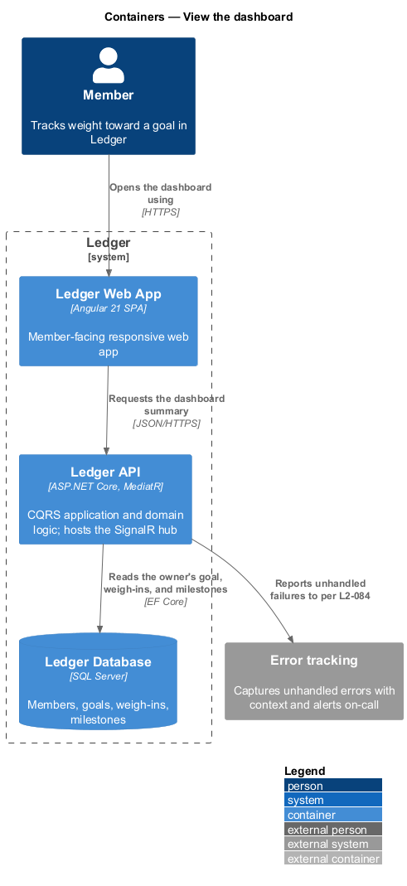
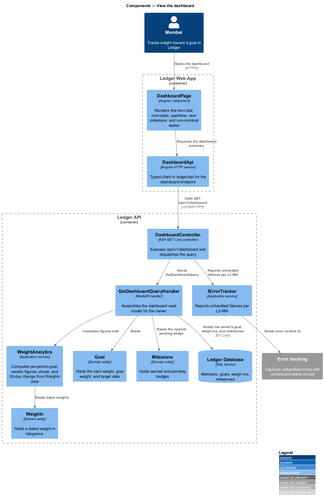
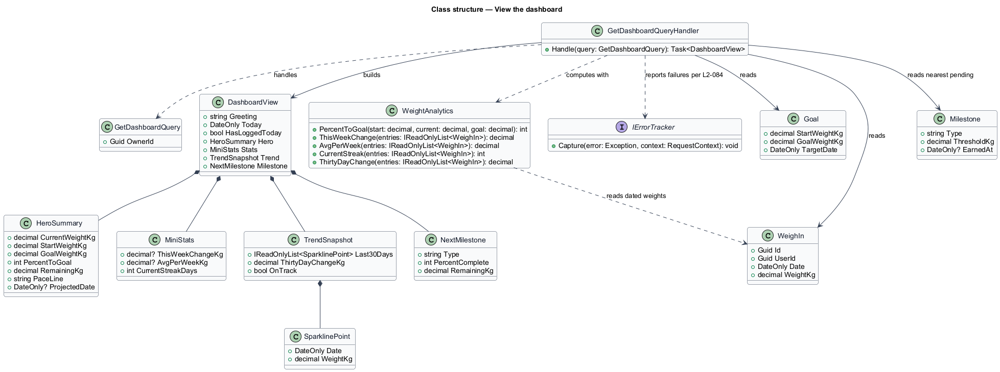
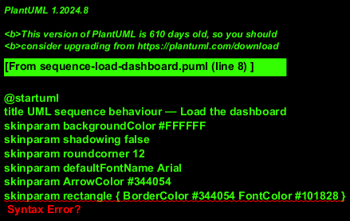

# View the dashboard

## Overview

Ledger is a responsive web application for weight tracking. A *member* is a
person who tracks weight toward a goal in Ledger. The *dashboard* is the landing
view a member reaches after signing in: a single read-only screen that
summarizes current standing at a glance and links out to the deeper screens.

*Dashboard summary* — one composed read model that draws together the member's
goal, latest weigh-in, and recent history into a hero dial, a row of mini-stats,
a 30-day trend snapshot, and the next milestone. The dashboard writes nothing; it
presents figures computed from the member's own weigh-ins.

*Hero dial* — the primary figure on the dashboard: current weight and
percent-to-goal, framed by Start and Goal chips and a plain-language pace line.
*Percent-to-goal* — progress from the start weight toward the goal weight,
clamped to the range 0 through 100.

The dashboard also carries its non-nominal states. It shows loading placeholders
before data arrives, an encouraging empty state for a member who has a goal but
no weigh-ins beyond the baseline, a celebration state when a milestone was just
reached, and a non-destructive error state with retry when a fetch fails. A
failed fetch is surfaced to operators through an external error-tracking system
while the member sees only the friendly state.

This document assumes no prior knowledge of Ledger's internals. Terms are defined
at first use, and the diagrams show where each part lives.

## Description

The feature is a vertical slice that runs from the dashboard screen to the
database, and reports failures to an external error-tracking system.

- **`DashboardPage`** — Angular component in the Ledger Web App. It renders the
  hero dial, the mini-stats row, the 30-day sparkline, and the next-milestone
  ring, and it owns the loading, empty, celebration, and error states.
- **`DashboardApi`** — typed Angular HTTP service in the `ledger/api` library. It
  requests the dashboard summary and returns a typed result to the page.
- **`DashboardController`** — ASP.NET Core controller in the Ledger API. It
  exposes the `/api/v1/dashboard` endpoint, authenticates the caller, scopes the
  request to the owner, and dispatches the query.
- **`GetDashboardQuery`** — the request object for the authenticated owner's
  dashboard read model.
- **`GetDashboardQueryHandler`** — MediatR handler in the Application layer. It
  reads the owner's goal, weigh-ins, and milestones, computes the dashboard
  figures through `WeightAnalytics`, and assembles the `DashboardView`.
- **`WeightAnalytics`** — application service that computes the dashboard figures
  from `WeighIn` data: percent-to-goal, the this-week change, the average change
  per week, the current streak, and the 30-day change.
- **`DashboardView`** — the read model returned to the client. It holds the
  greeting, the hero summary, the mini-stats, the 30-day trend snapshot, and the
  next milestone.
- **`Goal`** — domain entity that holds the start weight, the goal weight, and the
  target date.
- **`WeighIn`** — domain entity that holds a dated weight in kilograms for the
  owner.
- **`Milestone`** — domain entity that holds earned and pending badges; the
  nearest pending badge supplies the next-milestone figure.
- **`IErrorTracker`** — application service that captures an unhandled failure
  with context and forwards it to the external error-tracking system.

Weight is stored canonically in kilograms with one decimal; the display unit is a
per-member preference applied on the client. All dashboard figures are derived
values; the dashboard persists nothing.

## Requirements

The feature realizes the following level-2 (L2) requirements. Each L2 requirement
refines a level-1 (L1) requirement, cited by identifier.

| L2 ID | Refines (L1) | Requirement |
|-------|--------------|-------------|
| `L2-038` | `L1-008` | The dashboard summarizes current standing. |
| `L2-039` | `L1-008` | The dashboard shows quick stats. |
| `L2-040` | `L1-008` | The dashboard previews the recent trend and next milestone. |
| `L2-041` | `L1-008` | The dashboard handles non-nominal states. |
| `L2-084` | `L1-019` | Failures are surfaced to operators. |

## Diagrams

### System context

A member reads the dashboard summary through Ledger, which reports unhandled
failures to an external error-tracking system so operators are alerted while the
member sees a friendly state (`L2-084`).

### Containers

The dashboard request travels from the Ledger Web App to the Ledger API, which
reads the owner's goal, weigh-ins, and milestones from the Ledger Database and
reports unhandled failures to the error-tracking system.

### Components

Inside the Ledger API, `DashboardController` authenticates and scopes the request,
then dispatches `GetDashboardQuery`. `GetDashboardQueryHandler` reads the owner's
`Goal`, `WeighIn`, and `Milestone` records, computes the figures through
`WeightAnalytics`, and assembles the `DashboardView`; `IErrorTracker` reports an
unhandled failure to the external system (`L2-084`).

### Class structure

`GetDashboardQueryHandler` handles `GetDashboardQuery`, reads `Goal`, `WeighIn`,
and `Milestone`, computes figures through `WeightAnalytics`, and builds the
`DashboardView` from its hero summary, mini-stats, trend snapshot, and
next-milestone parts.

### Behaviour — load the dashboard

`DashboardPage` shows loading placeholders, then requests the summary. The `alt`
fragment separates three outcomes: a failed read, which `IErrorTracker` reports
to error tracking (`L2-084`) and which renders a non-destructive error state with
retry (`L2-041`); an owner with only the baseline entry, which renders the
encouraging empty state (`L2-041`); and data available, which computes the
figures through `WeightAnalytics` and renders the hero dial, mini-stats, 30-day
sparkline, and next milestone (`L2-038`, `L2-039`, `L2-040`).

