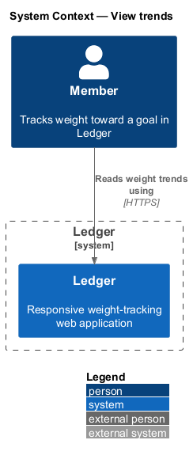
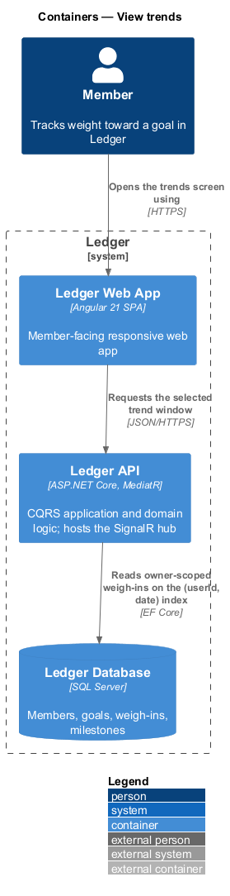
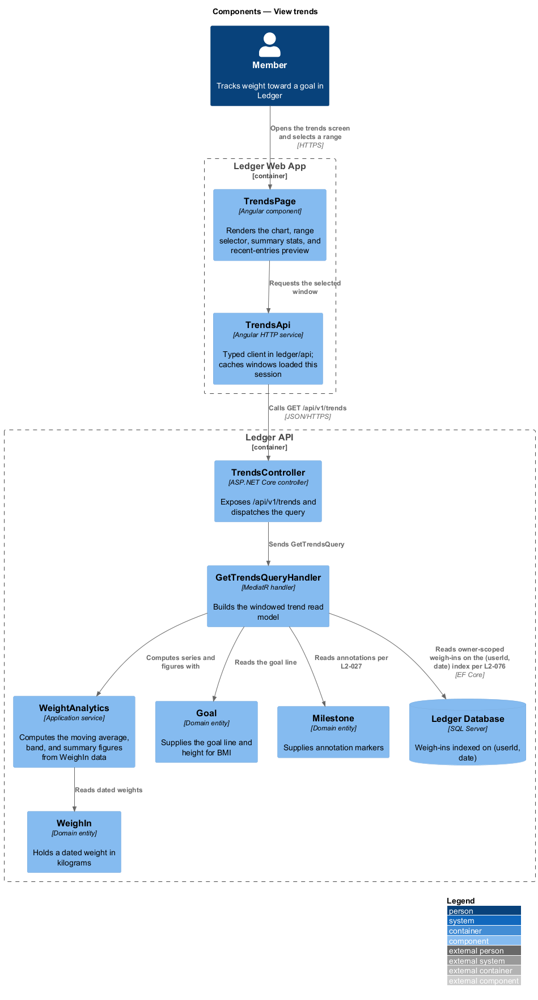
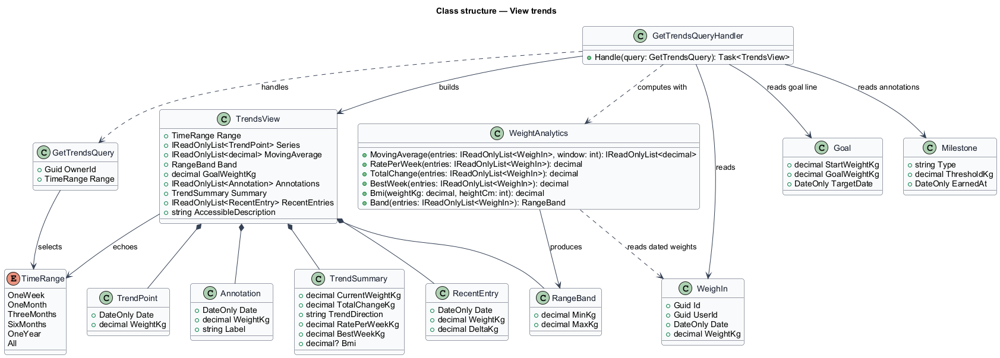
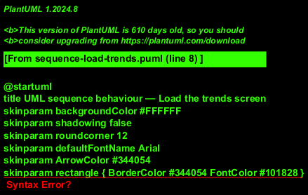
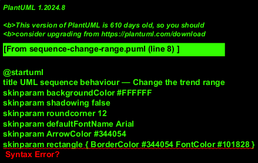

# View trends

## Overview

Ledger is a responsive web application for weight tracking. A *member* is a
person who tracks weight toward a goal in Ledger. The *trends* screen plots the
member's weight over time so the direction of travel toward the goal is legible
at a glance.

*Trend chart* — a plot of the member's weigh-ins across a selected time range. It
draws the daily series, a 7-day moving-average line, a shaded range band, and a
horizontal goal line, each visually distinguishable and each described in an
accessible label.

*Moving average* — the mean weight over a trailing 7-day window, computed over
available data so a gap in daily logging does not draw a false zero. *Range band*
— the shaded envelope between the lowest and highest weight on each day of the
window. *Time range* — the analysis window the member selects from 1W, 1M, 3M,
6M, 1Y, and All; the last selection is retained for the session.

The screen surrounds the chart with summary figures — rate per week, total change,
best week, and BMI — a milestone annotation for each achievement inside the range,
and a short recent-entries preview that links to full history. Every figure is a
derived value; the trends screen writes nothing.

This document assumes no prior knowledge of Ledger's internals. Terms are defined
at first use, and the diagrams show where each part lives.

## Description

The feature is a vertical slice that runs from the trends screen to the database.
No external system participates; the slice reads the member's own weigh-ins and
returns derived figures.

- **`TrendsPage`** — Angular component in the Ledger Web App. It renders the
  chart, the range selector, the summary stats, and the recent-entries preview,
  and it presents the accessible chart description.
- **`TrendsApi`** — typed Angular HTTP service in the `ledger/api` library. It
  requests the selected window, caches the windows already loaded this session,
  and returns a typed result to the page.
- **`TrendsController`** — ASP.NET Core controller in the Ledger API. It exposes
  the `/api/v1/trends` endpoint, authenticates the caller, scopes the request to
  the owner, and dispatches the query.
- **`GetTrendsQuery`** — the request object carrying the selected `TimeRange`.
- **`GetTrendsQueryHandler`** — MediatR handler in the Application layer. It reads
  the owner's weigh-ins for the window on the `(userId, date)` index, computes the
  series and figures through `WeightAnalytics`, overlays the goal line and
  milestone annotations, composes the accessible description, and assembles the
  `TrendsView`.
- **`WeightAnalytics`** — application service that computes the moving average,
  the range band, and the summary figures — rate per week, total change, best
  week, and BMI — from `WeighIn` data.
- **`TrendsView`** — the read model returned to the client. It holds the daily
  series, the moving average, the range band, the goal weight, the annotations,
  the summary, the recent entries, and the accessible description.
- **`WeighIn`** — domain entity that holds a dated weight in kilograms for the
  owner; the query reads it through the `(userId, date)` index.
- **`Goal`** — domain entity that supplies the goal line and the height for BMI.
- **`Milestone`** — domain entity whose earned achievements supply the chart
  annotations.
- **`TimeRange`** — enumeration of the selectable windows: `OneWeek`, `OneMonth`,
  `ThreeMonths`, `SixMonths`, `OneYear`, `All`.

Weight is stored canonically in kilograms with one decimal; the display unit is a
per-member preference applied on the client. The aggregation is bounded to the
requested window and uses the `(userId, date)` index, avoiding N+1 access.

## Requirements

The feature realizes the following level-2 (L2) requirements. Each L2 requirement
refines a level-1 (L1) requirement, cited by identifier.

| L2 ID | Refines (L1) | Requirement |
|-------|--------------|-------------|
| `L2-025` | `L1-005` | The trends screen plots weight over time. |
| `L2-026` | `L1-005` | The user selects the analysis range. |
| `L2-027` | `L1-005` | Achievements are annotated on the trend. |
| `L2-028` | `L1-005` | The trends screen surfaces summary figures. |
| `L2-029` | `L1-005` | A short recent-entries list previews history from the trends screen. |
| `L2-076` | `L1-017` | Aggregates are computed efficiently. |
| `L2-080` | `L1-018` | Assistive tech gets correct structure. |

## Diagrams

### System context

A member reads weight trends through Ledger. The slice is read-only and no
external system participates.

### Containers

The trend request travels from the Ledger Web App to the Ledger API, which reads
the owner's weigh-ins from the Ledger Database on the `(userId, date)` index and
returns the windowed figures.

### Components

Inside the Ledger API, `TrendsController` authenticates and scopes the request,
then dispatches `GetTrendsQuery`. `GetTrendsQueryHandler` reads the owner's
`WeighIn` records through the `(userId, date)` index (`L2-076`), computes the
series and figures through `WeightAnalytics`, and overlays the `Goal` line and
`Milestone` annotations.

### Class structure

`GetTrendsQueryHandler` handles `GetTrendsQuery`, reads `WeighIn`, `Goal`, and
`Milestone`, computes the moving average, band, and summary figures through
`WeightAnalytics`, and builds the `TrendsView` from its series, band, annotations,
summary, and recent-entry parts.

### Behaviour — load the trends screen

`TrendsPage` shows placeholders, then requests the default window.
`GetTrendsQueryHandler` reads the owner's weigh-ins on the `(userId, date)` index
(`L2-076`), computes the daily series, 7-day moving average, and range band
(`L2-025`), overlays the goal line and milestone annotations (`L2-027`), computes
the rate per week, total change, best week, and BMI (`L2-028`), and composes the
accessible chart description (`L2-080`) before returning the view with its
recent-entries preview (`L2-029`).

### Behaviour — change the range

`TrendsPage` retains the selected range for the session (`L2-026`). The `alt`
fragment separates a range already loaded this session — served from the client
cache without a network call (`L2-076`) — from a range not yet loaded, which
requests the window, recomputes the windowed aggregation on the `(userId, date)`
index (`L2-076`), and re-renders the chart, summary, and recent entries.

