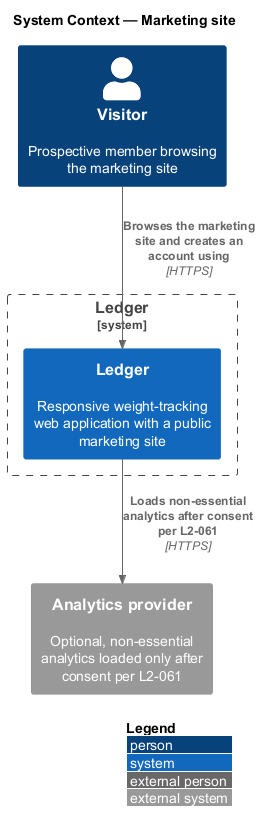
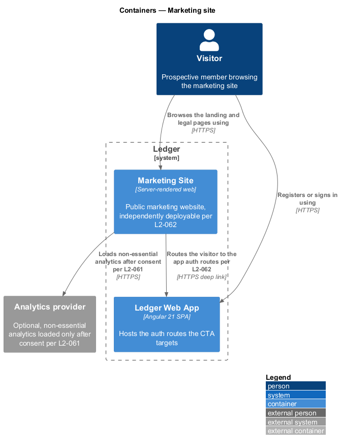
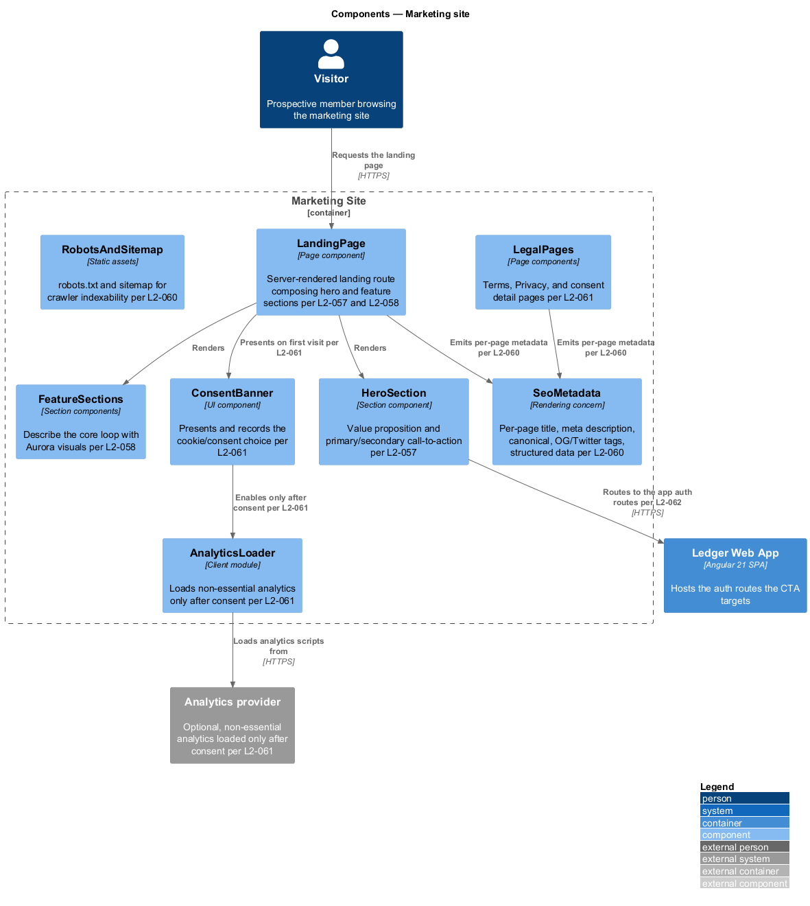
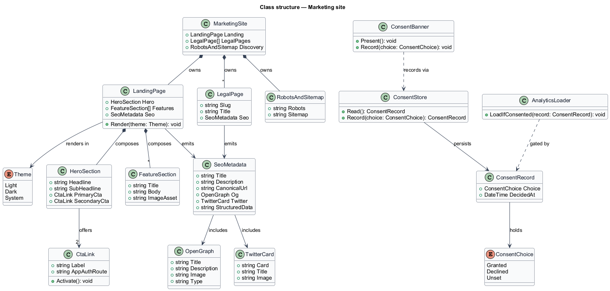
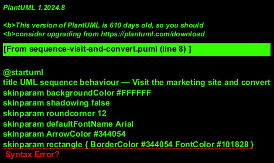
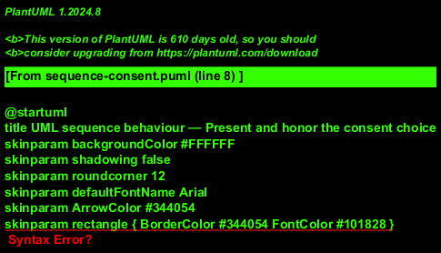

# Marketing site

## Overview

Ledger is a responsive web application for weight tracking: a member sets a goal
weight and target date, logs a daily weigh-in, reads the trend toward the goal,
and earns badges and streaks. This feature covers the property that sits in front
of that application and brings people to it.

**marketing site** — public, server-rendered website that presents Ledger's value
proposition, explains the product, and converts visitors into registered members

**visitor** — prospective member browsing the marketing site, not yet
authenticated

The marketing site is a distinct property from the member-facing application. It
requires no authentication, is fully static or server-rendered for indexability
and speed, and is deployable on its own release cadence. Its single conversion
path routes a visitor into the Ledger Web App's authentication routes, where
registration and sign-in live. The two properties share the Aurora design
language so the site and the app read as one product, yet neither depends on the
other's bundle to load.

The site also carries the product's public legal surface — Terms of Service and
Privacy Policy — and the consent notice that governs non-essential cookies. A
visitor's consent choice is recorded and honored on every subsequent visit.

The specific server-rendering framework and hosting platform are `<TO SUPPLY>`;
this design fixes the responsibilities and boundaries rather than the toolchain.

## Description

The feature is a frontend-first slice. It renders public pages, records a consent
choice in the browser, and hands off to the application for authentication.

- **`MarketingSite`** — the property root. It owns the landing page, the legal
  pages, and the crawler assets (`robots.txt`, sitemap).
- **`LandingPage`** — server-rendered landing route. It composes the hero and the
  feature sections and emits the page's SEO metadata.
- **`HeroSection`** — the value-proposition band. It presents Ledger's positioning
  and the primary and secondary calls-to-action.
- **`FeatureSections`** — the product-explanation bands. They describe the core
  loop — set a goal, log a weigh-in, read the trend, celebrate milestones — with
  Aurora visuals that match the app in light and dark.
- **`CtaLink`** — a labeled link whose target is an app authentication route. Its
  activation routes the visitor into the Ledger Web App per `L2-062`.
- **`LegalPages`** — the Terms, Privacy, and consent detail pages referenced at
  registration.
- **`ConsentBanner`** — presents the cookie/consent notice on a first visit and
  records the visitor's choice.
- **`ConsentStore`** — reads and persists the `ConsentRecord` that captures the
  choice and the time it was decided.
- **`AnalyticsLoader`** — client module that loads non-essential analytics only
  when the recorded choice grants consent.
- **`SeoMetadata`** — per-page title, meta description, canonical URL,
  Open Graph and Twitter card tags, and structured data, with a single `h1` per
  page.
- **`RobotsAndSitemap`** — the `robots.txt` and sitemap that make the site
  crawlable.

Responsive layout is a rendering property of the pages: the same components reflow
from a single column at XS to multi-column arrangements at MD and above, with no
horizontal page scrolling and legible type at every width (`L2-059`). Discovery
and speed are properties of the delivery: pages are pre-rendered and served with
complete metadata so crawlers index them and Core Web Vitals targets hold
(`L2-060`).

## Requirements

The feature realizes the following level-2 (L2) requirements. Each L2 requirement
refines a level-1 (L1) requirement, cited by identifier.

| L2 ID | Refines (L1) | Requirement |
|-------|--------------|-------------|
| `L2-057` | `L1-014` | A public landing page presents the value proposition and primary CTA. |
| `L2-058` | `L1-014` | The marketing site explains the product. |
| `L2-059` | `L1-014` | The marketing site is responsive. |
| `L2-060` | `L1-014` | The marketing site is discoverable and fast. |
| `L2-061` | `L1-014` | Terms, Privacy, and consent are provided. |
| `L2-062` | `L1-014` | The marketing site and app are cleanly separated but linked. |

## Diagrams

### System context

The visitor browses the marketing site and creates an account through Ledger. An
external analytics provider is loaded only after the visitor grants consent
(`L2-061`).

### Containers

The Marketing Site is a server-rendered property, independently deployable from
the Ledger Web App (`L2-062`). Its conversion path routes the visitor into the
app's authentication routes; the app is where registration and sign-in run.

### Components

Inside the Marketing Site, the `LandingPage` composes the `HeroSection` and
`FeatureSections` and emits `SeoMetadata`; the `HeroSection` routes to the app
auth routes; the `ConsentBanner` gates the `AnalyticsLoader` per `L2-061`.

### Class structure

`MarketingSite` owns the `LandingPage`, the `LegalPage` set, and the crawler
assets. The `LandingPage` composes the hero and feature sections and carries
`SeoMetadata`; consent is captured as a `ConsentRecord` that gates the
`AnalyticsLoader`.

### Behaviour — visit the marketing site and convert

The host returns pre-rendered HTML; the landing page renders the hero, value
proposition, and feature sections, then routes an activated call-to-action into
the app's registration or sign-in route per `L2-062`, without loading the app
bundle.

### Behaviour — present and honor the consent choice

On a first visit with no recorded choice, the consent notice is presented and the
choice recorded; non-essential analytics load only when consent is granted, and no
non-essential cookies are set otherwise, per `L2-061`.

