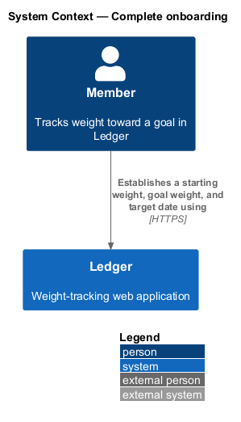
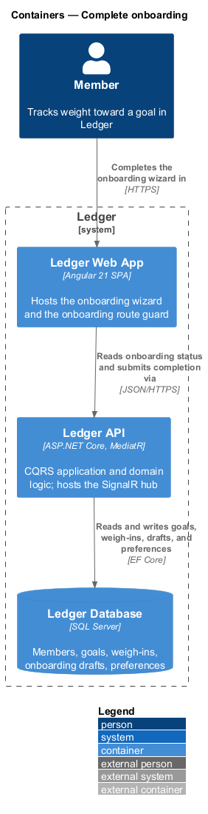
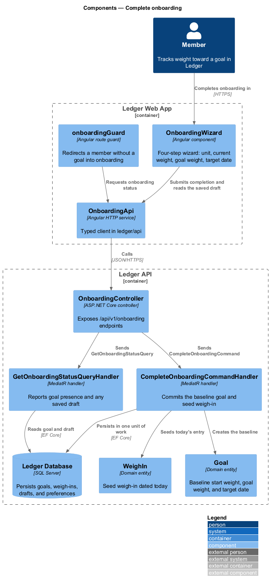
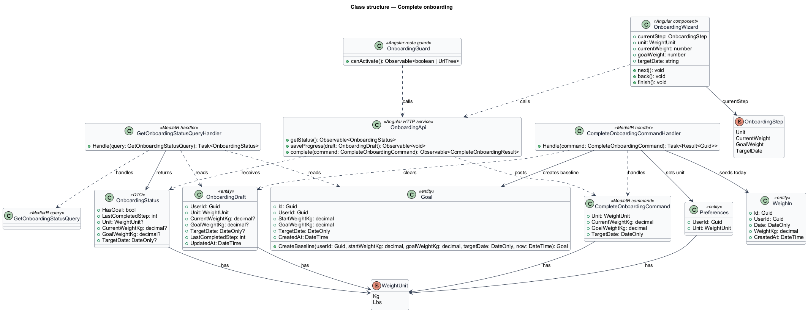
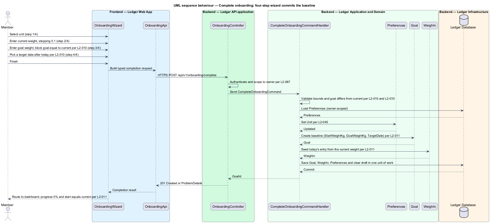
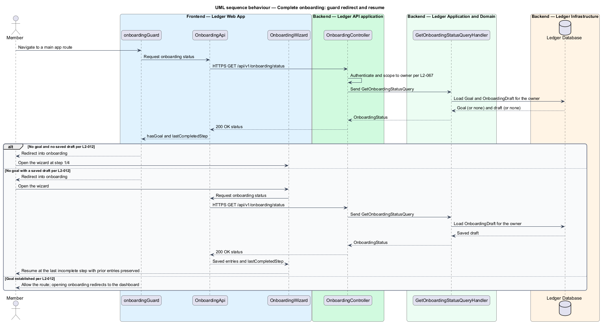

# Complete onboarding

## Overview

Ledger is a responsive web application for weight tracking. A *member* sets a
goal weight and a target date, logs a daily weigh-in, and reads the trend toward
the goal. Before any of that carries meaning, the member establishes a starting
point. This feature covers that first-run step: completing onboarding.

**onboarding** — first-run flow in which a newly verified member records the
inputs that establish a tracking baseline

A member who signs in for the first time holds no goal and no history. The
onboarding wizard collects four inputs in a fixed order — the weight unit, the
current weight, the goal weight, and the target date — and, on completion,
commits a baseline that every later screen reads from.

**onboarding wizard** — four-step flow that collects the unit, current weight,
goal weight, and target date behind a visible step indicator

**baseline** — the `Goal` and the first `WeighIn` that together anchor every
later trend, pace, and progress figure

Weight is stored canonically in kilograms with one decimal place; kilograms or
pounds is a display preference (L2-045). The current-weight step adjusts in 0.1
increments in the selected unit and is bounded on client and server (L2-015).
The goal-weight step blocks a goal equal to the current weight, and the
target-date step offers only dates after today (L2-010). On completion the
wizard creates a `Goal` whose start weight equals the entered current weight and
seeds a first weigh-in dated today, so the dashboard opens at 0% progress with
start equal to current (L2-011).

Onboarding is mandatory before the main application. A member without an
established goal shall not reach any main application route; the onboarding guard
redirects that member into the wizard (L2-012). Progress is durable: the wizard
records a draft as each step completes, so a member who leaves mid-way resumes at
the last incomplete step with prior entries preserved.

**onboarding draft** — server-side record of a member's partial onboarding
progress, retained so an interrupted wizard resumes where it stopped

**onboarding guard** — route guard that keeps a member without a goal inside
onboarding and redirects a member with a goal away from it

This document assumes no prior knowledge of Ledger's internals. The terms above
are defined at first use, and the diagrams show where each part lives.

## Description

The feature is a vertical slice that runs from the onboarding wizard to the
database.

- **`OnboardingWizard`** — Angular component in the Ledger Web App. It presents
  the four steps behind a step indicator (for example, "2/4"), supports Back
  without discarding earlier entries, and routes to the dashboard on completion.
- **`onboardingGuard`** — Angular route guard. It redirects a member without a
  goal into onboarding and redirects a member with a goal away from onboarding
  to the dashboard.
- **`OnboardingApi`** — typed Angular HTTP client in `ledger/api`. It reads
  onboarding status, saves step progress, and submits completion.
- **`OnboardingController`** — ASP.NET Core controller in the Ledger API. It
  exposes the `/api/v1/onboarding` endpoints, authenticates the caller, scopes
  every read and write to the owner, and dispatches the query and command.
- **`GetOnboardingStatusQuery`** and **`GetOnboardingStatusQueryHandler`** —
  MediatR query and handler. The handler reports whether a goal exists and
  returns any saved draft, so the guard decides redirection and the wizard
  resumes.
- **`CompleteOnboardingCommand`** — the request object carrying the `Unit`, the
  `CurrentWeightKg`, the `GoalWeightKg`, and the `TargetDate`.
- **`CompleteOnboardingCommandHandler`** — MediatR handler holding the use case.
  It validates the inputs, sets the unit preference, creates the baseline
  `Goal`, seeds today's `WeighIn`, clears the draft, and persists the change in
  one unit of work.
- **`Goal`** — domain entity holding `StartWeightKg`, `GoalWeightKg`,
  `TargetDate`, and `CreatedAt`. Its `CreateBaseline` factory enforces that the
  goal weight differs from the start weight and that the target date follows
  today.
- **`WeighIn`** — domain entity. The seed entry dated today carries the current
  weight and seeds the trend.
- **`OnboardingDraft`** — domain entity holding partial progress: the unit, the
  entered weights, the target date, and the last completed step for
  resumability.
- **`Preferences`** — domain entity. Onboarding sets its `Unit` from the first
  step.
- **`WeightUnit`** and **`OnboardingStep`** — enumerations of the display unit
  (`Kg`, `Lbs`) and the four steps (`Unit`, `CurrentWeight`, `GoalWeight`,
  `TargetDate`).

## Requirements

The feature realizes the following level-2 (L2) requirements. Each L2
requirement refines a level-1 (L1) requirement, cited by identifier.

| L2 ID | Refines (L1) | Requirement |
|-------|--------------|-------------|
| `L2-010` | `L1-002` | After first sign-in, the user completes a 4-step wizard with a visible step indicator (e.g. "2/4"). |
| `L2-011` | `L1-002` | Completing onboarding establishes the user's baseline. |
| `L2-012` | `L1-002` | Users cannot reach the main app without an established goal, and can resume an interrupted wizard. |

## Diagrams

### System context

The member establishes a starting weight, goal weight, and target date through
Ledger. The step needs no external system.

### Containers

The wizard and the route guard run in the Ledger Web App, which reads onboarding
status and submits completion to the Ledger API; the API persists the baseline
in the Ledger Database.

### Components

Inside the Ledger Web App the guard and wizard call `OnboardingApi`; inside the
Ledger API the controller dispatches the status query and the completion
command, and the completion handler creates the `Goal` and seeds the `WeighIn`.

### Class structure

`OnboardingWizard` advances through the `OnboardingStep` values and calls
`OnboardingApi`. `CompleteOnboardingCommandHandler` handles
`CompleteOnboardingCommand`, creates the baseline `Goal`, seeds the `WeighIn`,
sets the `Preferences` unit, and clears the `OnboardingDraft`;
`GetOnboardingStatusQueryHandler` reads the `Goal` and the `OnboardingDraft` to
build an `OnboardingStatus`.

### Behaviour — complete the wizard

The member advances the four steps, and on finish the controller authenticates
and scopes to the owner, then dispatches the command. The handler validates the
inputs (L2-015, L2-010), sets the unit (L2-045), creates the baseline `Goal` and
seeds today's `WeighIn` (L2-011), and commits in one unit of work; the wizard
then routes to the dashboard at 0% progress.

### Behaviour — onboarding guard and resume

On navigation to a main application route the guard reads onboarding status. A
member without a goal is redirected into onboarding; when a saved draft exists
the wizard resumes at the last incomplete step with prior entries preserved,
otherwise it opens at step 1. A member with an established goal proceeds, and
opening onboarding redirects to the dashboard (L2-012).

