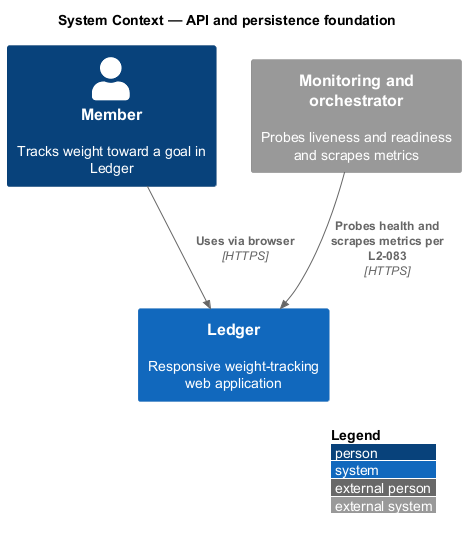
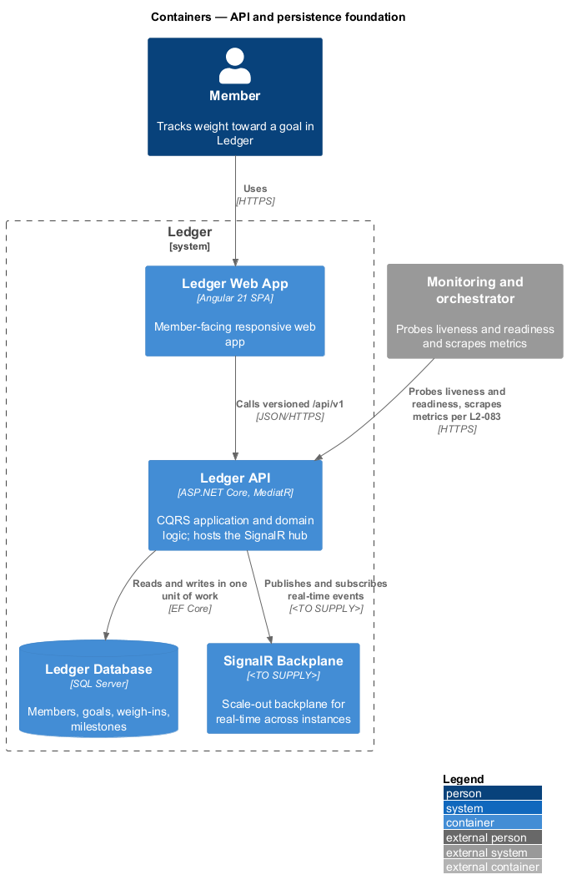
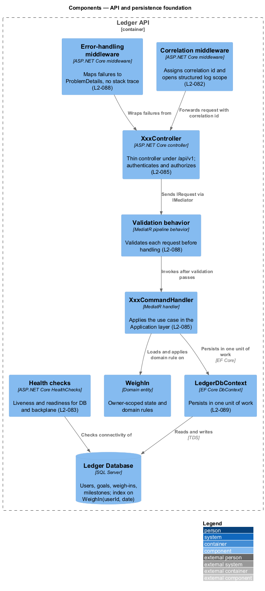
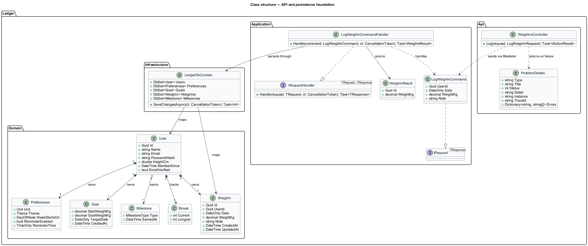
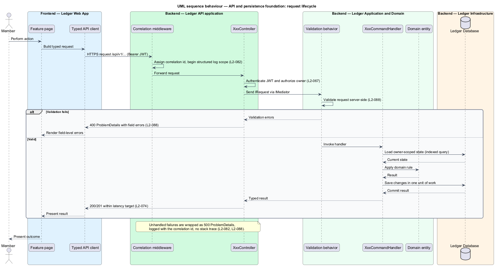
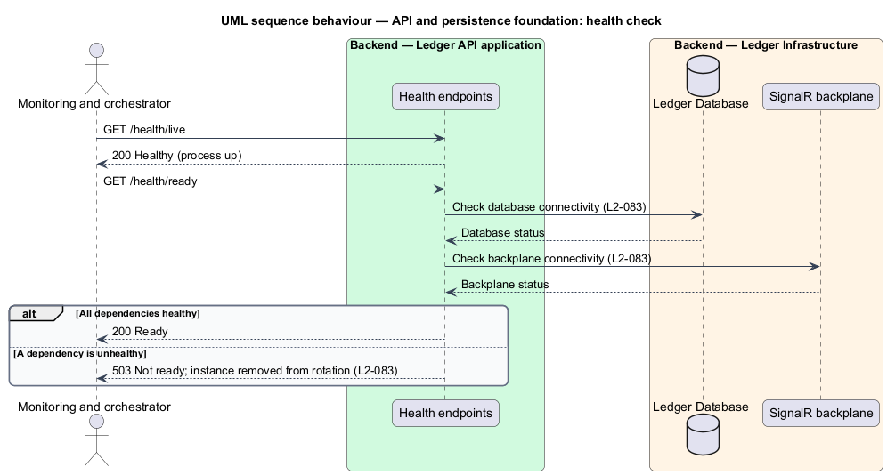

# API and persistence foundation

## Overview

Ledger is a responsive web application for weight tracking. Its backend applies
each member action through one consistent request pipeline and persists state to
a relational database. This document describes that foundation, on which every
backend feature is built.

**api and persistence foundation** — backend slice that establishes the
clean-architecture layering, the versioned request pipeline, the consistent error
envelope, structured logging, health probes, and the EF Core data model with
migrations

**CQRS** — separation of command and query responsibilities; each use case is a
MediatR request handled by exactly one handler

**ProblemDetails** — the consistent error envelope returned on failure, carrying a
code, a message, and field-level errors, never a raw stack trace

The backend separates `Ledger.Domain` (entities and value objects),
`Ledger.Application` (MediatR command and query handlers with validation),
`Ledger.Infrastructure` (EF Core over SQL Server, JWT, SignalR, mail), and
`Ledger.Api` (controllers and middleware), with dependencies pointing inward only
(`L2-085`). Every authenticated request flows from a thin controller under
`/api/v1`, through a MediatR handler, into EF Core, and commits in one unit of
work (`L2-088`). Failures return `ProblemDetails` (`L2-088`); each request carries
a correlation id through structured logs (`L2-082`); liveness and readiness probes
report the health of the database and the SignalR backplane (`L2-083`); and the
schema is expressed as EF Core migrations with an index on `WeighIn(userId, date)`
(`L2-089`). Read endpoints meet a p95 target below 300 ms and write endpoints
below 400 ms (`L2-074`), and every acceptance test carries a `Traces to: L2-xxx`
comment (`L2-087`).

This document assumes no prior knowledge of Ledger's internals. Terms are defined
at first use, and the diagrams show where each part lives.

## Description

The foundation is a vertical slice that runs from a typed frontend client to the
database, shared by every backend feature. `LogWeighInCommand` stands in below as
a representative use case.

- **`XxxController`** — thin ASP.NET Core controller in `Ledger.Api`, exposed under
  `/api/v1`. It authenticates the JWT bearer token, authorizes the owner, and
  dispatches a MediatR request. It holds no domain logic (`L2-085`).
- **`IRequest<TResponse>`** — MediatR marker for a command or query. `IRequest`
  carries the input for one use case; the response type names its result.
- **`IRequestHandler<TRequest, TResponse>`** — MediatR handler contract. Exactly
  one handler applies each request in `Ledger.Application` (`L2-085`).
- **Validation behavior** — MediatR pipeline behavior. It validates each request
  server-side for type, range, and length before the handler runs (`L2-088`).
- **`LedgerDbContext`** — EF Core `DbContext` in `Ledger.Infrastructure`. It maps
  entities to SQL Server and commits each request in one unit of work (`L2-089`).
- **Domain entities** — `User`, `Preferences`, `Goal`, `WeighIn`, `Milestone`, and
  `Streak` in `Ledger.Domain`, with weights stored canonically in kilograms and a
  unique constraint on `WeighIn(userId, date)` (`L2-089`).
- **`ProblemDetails`** — the error envelope. Error-handling middleware maps
  validation failures to `400` with field errors, authorization failures to
  `401`/`403`, and unhandled failures to `500`, each as `ProblemDetails` without a
  stack trace (`L2-088`).
- **Correlation middleware** — ASP.NET Core middleware. It assigns a correlation
  id to each request and opens a structured (JSON) log scope propagated across
  layers, excluding secrets and PII (`L2-082`).
- **Health checks** — ASP.NET Core health endpoints. Liveness reports process
  health; readiness reports the database and SignalR-backplane status and removes
  an unhealthy instance from rotation (`L2-083`).
- **Testing stack** — xUnit unit tests and `WebApplicationFactory` integration
  tests against a real SQL database on the backend, and Jest unit tests with
  Playwright end-to-end journeys on the frontend; each acceptance test is written
  first, fails, then is made to pass, and carries a `Traces to: L2-xxx` header
  (`L2-087`).

## Requirements

The feature realizes the following level-2 (L2) requirements. Each L2 requirement
refines a level-1 (L1) requirement, cited by identifier.

| L2 ID | Refines (L1) | Requirement |
|-------|--------------|-------------|
| `L2-085` | `L1-020` | The backend mirrors Liturgy's architecture. |
| `L2-088` | `L1-020` | The REST API is consistent and versioned. |
| `L2-089` | `L1-020` | EF Core over SQL Server with migrations. |
| `L2-074` | `L1-017` | The API is fast under normal load. |
| `L2-082` | `L1-019` | Logs are structured and traceable. |
| `L2-083` | `L1-019` | The system is observable and probeable. |
| `L2-087` | `L1-020` | Tests follow the Liturgy stack and ATDD. |

## Diagrams

### System context

A member uses Ledger through the web app, and a monitoring and orchestration
system probes the API's health and scrapes its metrics (`L2-083`).

### Containers

The Ledger Web App calls the versioned Ledger API, which reads and writes the
Ledger Database through EF Core in one unit of work and coordinates real-time
delivery through a scale-out SignalR backplane; the monitor probes the API's
liveness and readiness (`L2-083`).

### Components

Inside the Ledger API, a thin controller dispatches a MediatR request through the
validation behavior to its handler; the handler applies a domain rule and persists
it through `LedgerDbContext` in one unit of work, while error-handling and
correlation middleware wrap the exchange and health checks probe the database.

### Class structure

The layers group the types: a controller and the `ProblemDetails` envelope in
`Ledger.Api`; the MediatR `IRequest`/`IRequestHandler` contracts and a
representative command and handler in `Ledger.Application`; the entities in
`Ledger.Domain`; and `LedgerDbContext` in `Ledger.Infrastructure` (`L2-085`,
`L2-088`, `L2-089`).

### Behaviour — request lifecycle

An authenticated request passes through correlation middleware, a thin controller,
and the MediatR validation behavior to its handler, which loads owner-scoped state,
applies a domain rule, and commits in one unit of work; validation failures return
`400` `ProblemDetails` with field errors (`L2-082`, `L2-088`, `L2-074`).

### Behaviour — health check

A monitor probes liveness for process health and readiness for the database and
SignalR-backplane status; an unhealthy dependency yields `503` so the instance is
removed from rotation (`L2-083`).

