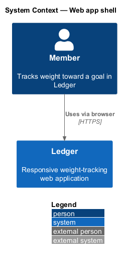
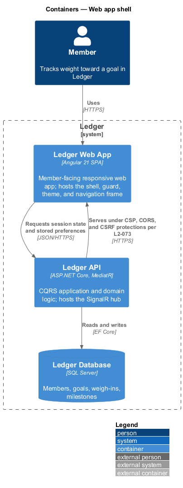
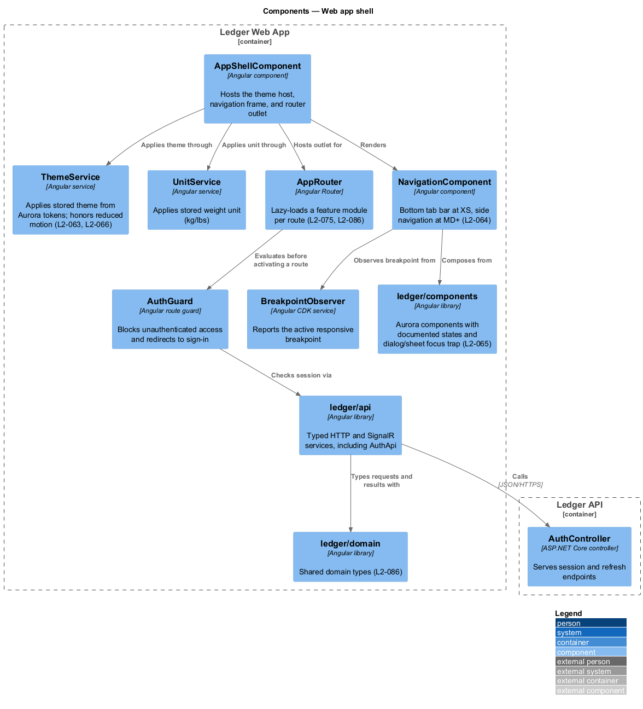
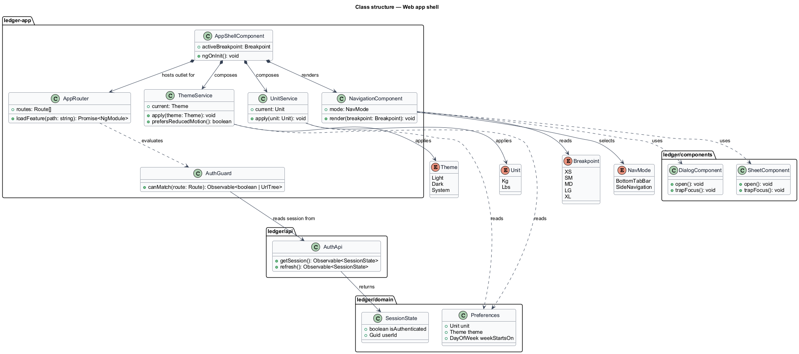
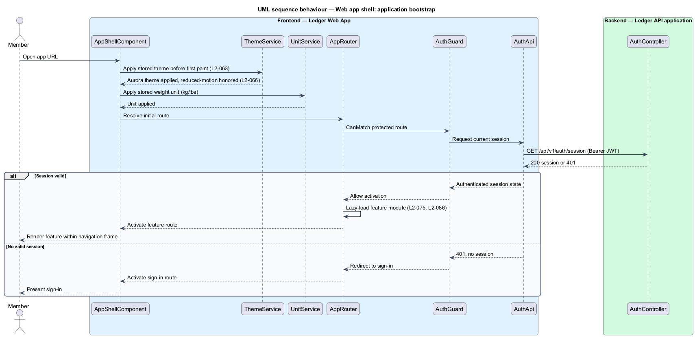
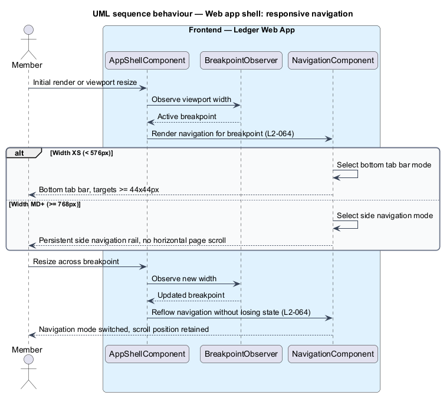

# Web app shell

## Overview

Ledger is a responsive web application for weight tracking. A member sets a goal
weight and target date, logs a daily weigh-in, reads the trend toward the goal,
and earns badges and streaks. Every feature renders inside one host application,
and this document describes that host.

**web app shell** — root Angular application that bootstraps the single-page
application, applies stored preferences before first paint, guards routes,
and hosts the adaptive navigation frame into which feature modules load

**Aurora** — Ledger's design token system supplying color, spacing, typography,
elevation, radius, and motion values, with a light and a dark theme

The shell is a cross-cutting foundational slice rather than a member-facing
feature. It owns six concerns: application bootstrap; theme and unit application
from Aurora tokens (`L2-063`); the authentication route guard that redirects
unauthenticated members to sign-in; the responsive navigation frame that shows a
bottom tab bar at XS and persistent side navigation at MD and above (`L2-064`);
component-state and focus-trap parity with the design system (`L2-065`); and
motion that respects a reduced-motion preference (`L2-066`). It sits behind the
browser-facing security headers, CORS, and CSRF protections the API serves
(`L2-073`), conforms to WCAG 2.1 AA (`L2-078`), and is organized as the
`ledger-app` shell plus the `ledger/api`, `ledger/components`, and
`ledger/domain` libraries (`L2-086`).

This document assumes no prior knowledge of Ledger's internals. Terms are defined
at first use, and the diagrams show where each part lives.

## Description

The shell is a vertical slice that runs from the browser to the API. It renders
the frame, resolves preferences and session state, and hands control to a
lazily-loaded feature module.

- **`AppShellComponent`** — root Angular component. It hosts the navigation
  frame, the theme host, and the router outlet into which feature routes render.
- **`ThemeService`** — Angular service in the shell. It reads the stored theme
  (light, dark, or system) and applies the matching Aurora token set, and it
  honors `prefers-reduced-motion` so non-essential motion is disabled per
  `L2-066`.
- **`UnitService`** — Angular service that applies the stored weight unit
  (kg or lbs) so every screen displays values in the member's chosen unit.
- **`AuthGuard`** — Angular route guard implementing `CanMatch`. It admits a
  member with a valid session and redirects an unauthenticated member to
  sign-in before any protected route activates.
- **`AppRouter`** — Angular Router configuration. It lazy-loads the feature
  module for the target route so the initial bundle stays small (`L2-075`,
  `L2-086`).
- **`NavigationComponent`** — Angular component in `ledger/components`. It renders
  a bottom tab bar at XS and a persistent side navigation rail at MD and above,
  driven by the active breakpoint (`L2-064`).
- **`BreakpointObserver`** — Angular CDK service reporting the active responsive
  breakpoint (XS, SM, MD, LG, XL) as the viewport changes.
- **`AuthApi`** — typed Angular HTTP client in `ledger/api`. It calls the session
  and refresh endpoints and returns typed session state to the guard.
- **Library boundaries** — `ledger/api` confines HTTP and SignalR access,
  `ledger/components` holds the Aurora component set with its documented states
  and dialog/sheet focus trap (`L2-065`), and `ledger/domain` holds shared types
  (`L2-086`).
- **`AuthController`** — ASP.NET Core controller in the Ledger API. It serves the
  session and refresh endpoints the guard depends on, behind the security
  headers, CORS, and CSRF configuration required by `L2-073`.

## Requirements

The feature realizes the following level-2 (L2) requirements. Each L2 requirement
refines a level-1 (L1) requirement, cited by identifier.

| L2 ID | Refines (L1) | Requirement |
|-------|--------------|-------------|
| `L2-063` | `L1-015` | The UI is built on Aurora tokens with dual themes. |
| `L2-064` | `L1-015` | The app adapts from mobile to desktop. |
| `L2-065` | `L1-015` | App components match the design system. |
| `L2-066` | `L1-015` | Motion is polished but respectful. |
| `L2-073` | `L1-016` | Browser-facing protections are configured. |
| `L2-075` | `L1-017` | The web app loads and runs efficiently. |
| `L2-078` | `L1-018` | The product meets WCAG 2.1 AA. |
| `L2-086` | `L1-020` | The frontend mirrors Liturgy's workspace layout. |

## Diagrams

### System context

A member uses Ledger through a browser. The shell is the entry surface every
feature renders inside; no external system participates in the shell slice.

### Containers

The member's browser runs the Ledger Web App, which calls the Ledger API for
session state and stored preferences. The API serves responses under the
security headers, CORS, and CSRF configuration required by `L2-073`.

### Components

Inside the Ledger Web App, `AppShellComponent` applies the theme, hosts the
router outlet and navigation frame, and defers route activation to `AuthGuard`;
the guard checks session state through `AuthApi`, and the shell draws from the
`ledger/api`, `ledger/components`, and `ledger/domain` libraries (`L2-086`).

### Class structure

`AppShellComponent` composes `ThemeService`, `UnitService`, `AppRouter`, and
`NavigationComponent`; `AuthGuard` reads session state from `AuthApi`; and the
library boundaries group the shell types by their Angular package (`L2-086`).

### Behaviour — application bootstrap

The single-page application loads, applies the stored theme and unit before first
paint, and resolves the initial route. `AuthGuard` admits an authenticated member
and lazy-loads the feature module, or redirects an unauthenticated member to
sign-in (`L2-075`, `L2-086`).

### Behaviour — responsive navigation

`AppShellComponent` observes the active breakpoint and renders the primary
navigation as a bottom tab bar at XS or as a persistent side navigation rail at
MD and above, without horizontal page scrolling and with touch targets of at
least 44×44px (`L2-064`).

