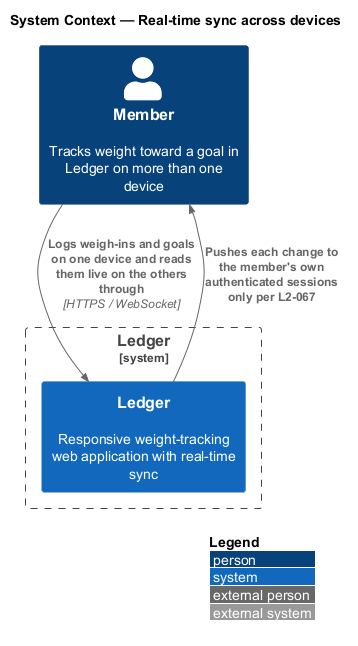
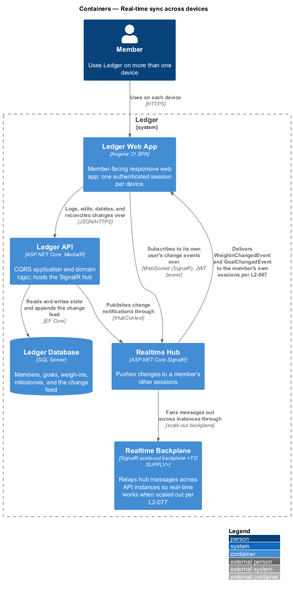
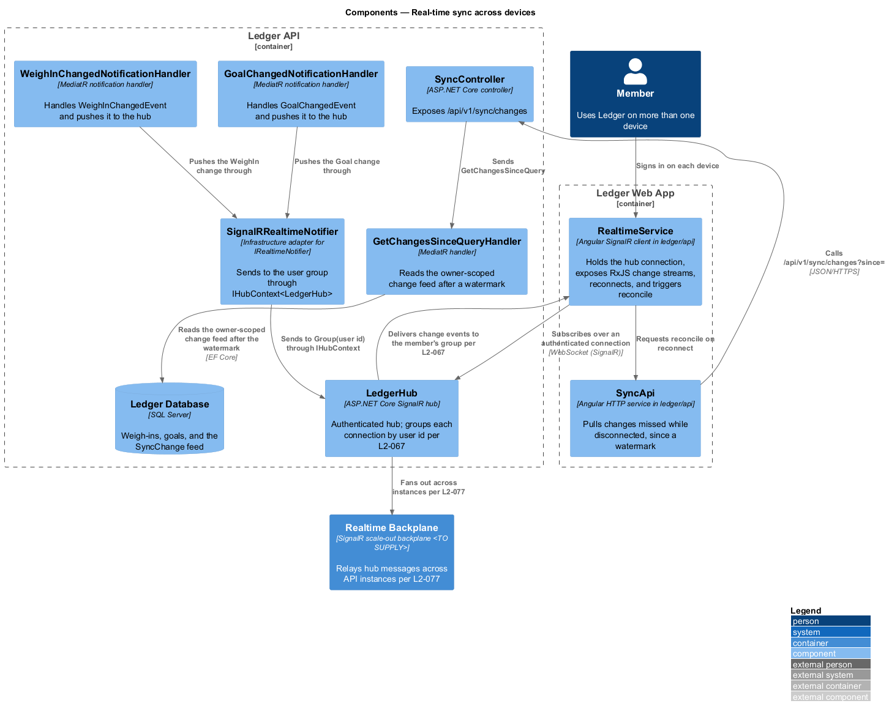
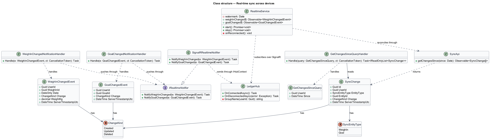
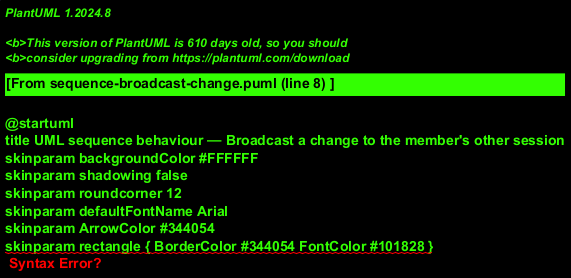
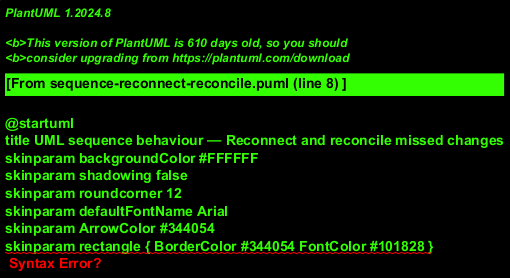
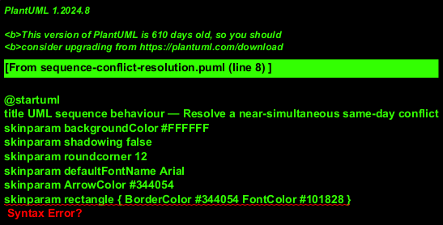

# Real-time sync across devices

## Overview

Ledger is a responsive web application for weight tracking. A *member* is a
person who tracks weight toward a goal in Ledger, and a member may be signed in
on more than one device at the same time. This feature keeps those signed-in
views consistent: a change made on one device appears on the member's other
devices without a manual refresh.

*Real-time sync* — propagation of a member's own data changes to that member's
other active sessions in near real time. The changes that propagate are the
logging, editing, and deletion of a weigh-in and any change to the goal.

*Session* — an authenticated connection held by one of the member's signed-in
devices. Each session subscribes to change events for its own member and for no
other member.

*SignalR hub* — server endpoint that maintains a persistent connection to each
session and pushes messages to sessions grouped by member. Ledger names its hub
`LedgerHub`.

*Backplane* — shared relay that distributes hub messages across API instances,
so a message reaches a session whichever instance holds its connection.

*Watermark* — server timestamp marking the latest change a session has applied.
A reconnecting session presents its watermark to pull the changes it missed.

This feature realizes three behaviours: broadcasting a change to the member's
other sessions, reconnecting and reconciling missed changes after a dropped
connection, and resolving a near-simultaneous same-day conflict by last-write-
wins on the server timestamp. This document assumes no prior knowledge of
Ledger's internals. Terms are defined at first use, and the diagrams show where
each part lives.

## Description

The feature is a vertical slice that spans the frontend real-time client, the
SignalR hub, the notification path that pushes changes, and the reconcile query
that recovers missed changes. The write use cases that originate the changes —
`LogWeighInCommand`, `EditWeighInCommand`, `DeleteWeighInCommand`, and the goal
commands — belong to their own slices; this feature covers the propagation that
follows a committed change.

- **`RealtimeService`** — Angular SignalR client in the `ledger/api` library. It
  holds the authenticated hub connection, exposes the change events as RxJS
  streams the app subscribes to, reconnects when the connection drops, and
  triggers reconcile on reconnect. It retains the watermark of the latest
  applied change.
- **`SyncApi`** — typed Angular HTTP service in the `ledger/api` library. It
  pulls the changes missed while disconnected, since the watermark.
- **`LedgerHub`** — ASP.NET Core SignalR hub. It authenticates each connection
  and, on connect, adds it to a group keyed by the member's user id, so a session
  receives only its own member's events per `L2-067`.
- **`WeighInChangedEvent`** — notification carrying `UserId`, `WeighInId`,
  `Date`, the `ChangeKind`, the weight in canonical kilograms, and the server
  timestamp. A write use case publishes it after the change commits.
- **`GoalChangedEvent`** — notification carrying `UserId`, `GoalId`, the
  `ChangeKind`, and the server timestamp, published after a goal change commits.
- **`WeighInChangedNotificationHandler`** and **`GoalChangedNotificationHandler`**
  — MediatR notification handlers that receive the events and push them to the
  hub through the notifier port.
- **`IRealtimeNotifier`** — application port for pushing a change to a member's
  sessions. Its infrastructure adapter **`SignalRRealtimeNotifier`** sends to the
  member's group through `IHubContext<LedgerHub>`, keeping the SignalR dependency
  out of the application layer.
- **`SyncController`** — ASP.NET Core controller in the Ledger API. It exposes
  `/api/v1/sync/changes`, authenticates the caller, and scopes the query to the
  owner per `L2-067`.
- **`GetChangesSinceQuery`** and **`GetChangesSinceQueryHandler`** — MediatR query
  and handler that read the owner-scoped change feed after a watermark.
- **`SyncChange`** — append-only feed record carrying `UserId`, `EntityType`,
  `EntityId`, the `ChangeKind`, and the server timestamp. A write use case appends
  it in the same unit of work as the change, so the feed never diverges from
  stored state. The reconcile query replays it; the retention window of the feed
  is `<TO SUPPLY>`.
- **`ChangeKind`** — enumeration of the kinds of change a record describes:
  `Created`, `Updated`, `Deleted`.
- **`Realtime Backplane`** — SignalR scale-out backplane that relays hub messages
  across API instances per `L2-077`. Its concrete technology is `<TO SUPPLY>`.

The push path is best-effort: a session that misses a pushed message recovers it
through reconcile against the change feed, which is the authoritative record. The
hub authenticates every connection with the JWT bearer token, so the API holds no
per-session server state and scales out behind the backplane per `L2-077`.

## Requirements

The feature realizes the following level-2 (L2) requirements. Each L2
requirement refines a level-1 (L1) requirement, cited by identifier.

| L2 ID | Refines (L1) | Requirement |
|-------|--------------|-------------|
| `L2-055` | `L1-013` | Changes propagate live to the user's other sessions. |
| `L2-056` | `L1-013` | Concurrent edits resolve deterministically. |
| `L2-067` | `L1-016` | Users can access only their own data. |
| `L2-077` | `L1-017` | The system scales horizontally. |

## Diagrams

### System context

A member uses Ledger across more than one device, and Ledger pushes each change
to the member's own authenticated sessions only.

### Containers

The Ledger Web App calls the Ledger API over REST and holds a SignalR connection
to the Realtime Hub. The API persists state and appends the change feed in the
Ledger Database, and the hub fans messages out across API instances through the
Realtime Backplane per `L2-077`.

### Components

`RealtimeService` subscribes to `LedgerHub`, which groups each connection by user
id per `L2-067`. The notification handlers push changes through
`SignalRRealtimeNotifier` to the hub, and `SyncController` serves the reconcile
pull through `GetChangesSinceQueryHandler` against the change feed.

### Class structure

The write use cases publish `WeighInChangedEvent` and `GoalChangedEvent`, which
the notification handlers push through `IRealtimeNotifier`.
`SignalRRealtimeNotifier` realizes the port over `LedgerHub`, and
`GetChangesSinceQueryHandler` reads the `SyncChange` feed for reconcile.

### Behaviour — broadcast a change to the member's other session

The controller authorizes the owner (`L2-067`), the handler upserts the day's
entry and appends the change feed in one unit of work (`L2-016`), and the
notification handler pushes `WeighInChangedEvent` to the member's group only
(`L2-067`); the backplane fans it out across instances (`L2-077`) so device B
reflects the change without a manual refresh (`L2-055`). Editing and deleting a
weigh-in and changing the goal follow the same path through their own handlers.

### Behaviour — reconnect and reconcile missed changes

After the connection drops and connectivity returns, `RealtimeService` reconnects
with its JWT bearer token, the hub re-adds it to the member's group (`L2-067`),
and the session pulls changes since its watermark through `SyncController`. The
`alt` fragment applies the missed creates, edits, and deletes and advances the
watermark, or keeps the watermark when none were missed (`L2-055`).

### Behaviour — resolve a near-simultaneous same-day conflict

Two devices edit the same day near-simultaneously. The unique `userId+date` key
serializes both writes (`L2-016`); the server stamps each with its own timestamp,
and the later write wins (`L2-056`). The hub broadcasts the authoritative value to
the member's sessions, and the device holding the stale value replaces it
(`L2-056`).

