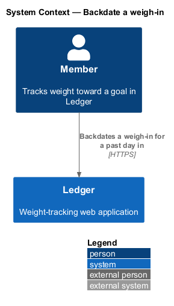
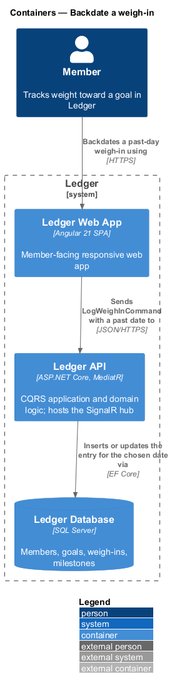
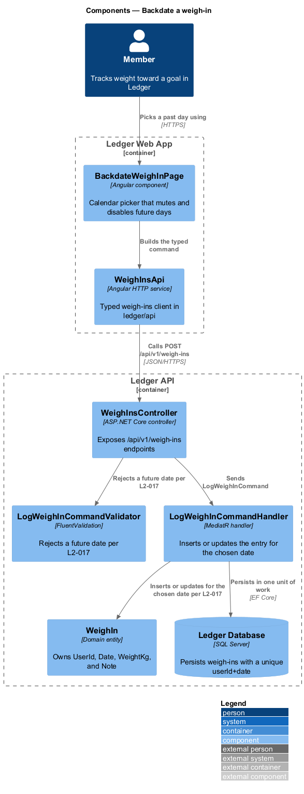
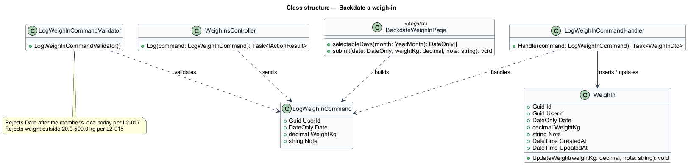
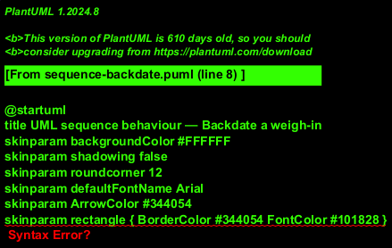

# Backdate a weigh-in

## Overview

Ledger is a responsive web application for weight tracking. A *member* is a
person who tracks weight toward a goal in Ledger. Members do not always log on
the day they weigh themselves. This feature lets a member record a weight for a
day that has already passed, so the trend reflects the true history rather than
only the days a member remembered to open the app.

*backdate* — recording of a weigh-in for a calendar day earlier than today,
chosen from a calendar picker

*future date* — any calendar day after the member's local today; a future date is
not a valid weigh-in date and is rejected on both client and server

A member opens a calendar that marks today, offers past days for selection, and
mutes future days so they cannot be chosen. On a chosen past day the member
enters a weight, which the feature inserts or updates for that date. Because at
most one weigh-in exists per member per calendar day, a backdated entry for a day
that already has one updates it rather than adding a duplicate. Saving re-averages
history and the trend, and offers an undo.

This document assumes no prior knowledge of Ledger's internals. Terms are defined
at first use, and the diagrams show where each part lives.

## Description

The feature is a vertical slice that runs from the calendar screen to the
database. It reuses the log command of the log-weigh-in slice with an explicit
past date.

- **`BackdateWeighInPage`** — Angular component in the Ledger Web App. It renders
  the month calendar, marks today, keeps past days selectable, and renders future
  days muted and non-interactive. It builds the request only for a past or
  present date.
- **`WeighInsApi`** — typed Angular HTTP service in the `ledger/api` library. It
  builds the log request for the chosen date and returns a typed result.
- **`WeighInsController`** — ASP.NET Core controller in the Ledger API. It exposes
  the `/api/v1/weigh-ins` endpoints, authenticates and authorizes the caller, and
  dispatches the command.
- **`LogWeighInCommand`** — the request object carrying `UserId`, the chosen
  `Date`, `WeightKg`, and `Note`.
- **`LogWeighInCommandValidator`** — validator that rejects a `Date` after the
  member's local today with "Future dates can't be logged", independent of the
  client check.
- **`LogWeighInCommandHandler`** — MediatR handler that loads the owner's entry
  for the chosen day, inserts or updates a single entry, and persists the change
  in one unit of work.
- **`WeighIn`** — domain entity that owns `UserId`, `Date`, `WeightKg`, `Note`,
  and the `CreatedAt`/`UpdatedAt` timestamps.

The future-date rule is enforced in two places: the calendar disables future days
in the UI, and the validator rejects a future date on the server, so a crafted
request cannot bypass the client guard. Month navigation disables movement beyond
the account's earliest allowed range.

## Requirements

The feature realizes the following level-2 (L2) requirement. The L2 requirement
refines a level-1 (L1) requirement, cited by identifier.

| L2 ID | Refines (L1) | Requirement |
|-------|--------------|-------------|
| `L2-017` | `L1-003` | The user logs a weight for a previous day via a calendar picker. |

## Diagrams

### System context

A member backdates a weigh-in through Ledger. The action reaches no external
system.

### Containers

The backdated entry travels from the Ledger Web App to the Ledger API, which
inserts or updates the entry for the chosen date in the Ledger Database.

### Components

Inside the Ledger Web App, `BackdateWeighInPage` builds a request through
`WeighInsApi` only for a past or present day. Inside the Ledger API,
`WeighInsController` rejects a future date through `LogWeighInCommandValidator`
(`L2-017`), then dispatches `LogWeighInCommand`, and the handler inserts or
updates the `WeighIn` entity for the chosen date.

### Class structure

`WeighInsController` sends `LogWeighInCommand`; `LogWeighInCommandValidator`
rejects a future date (`L2-017`); `LogWeighInCommandHandler` inserts or updates
the `WeighIn` entity for the chosen date. `BackdateWeighInPage` computes the
selectable days for a month and builds the command.

### Behaviour — backdate a weigh-in

The member opens the calendar, which mutes future days (`L2-017`). The outer
`alt` fragment separates a blocked future-day selection from a valid past-day
save. The inner `alt` fragment shows the server re-check that rejects a future
date with "Future dates can't be logged" (`L2-017`); the accepted path inserts or
updates the entry, re-averages history and the trend, and shows a toast with Undo
(`L2-017`).

