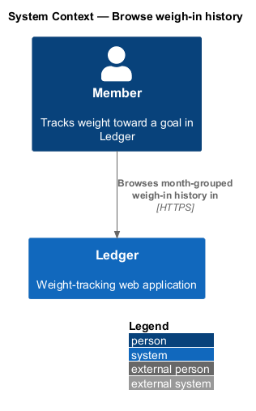
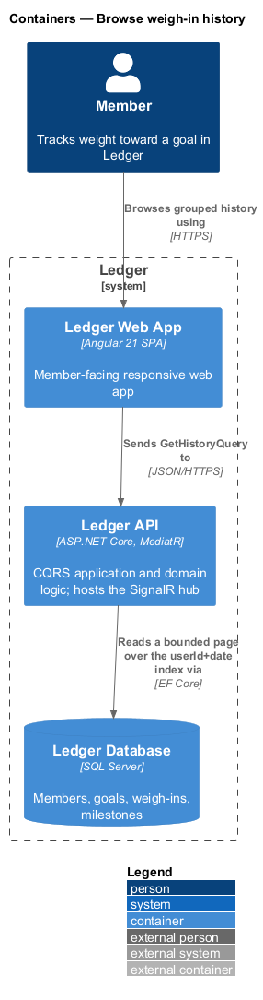
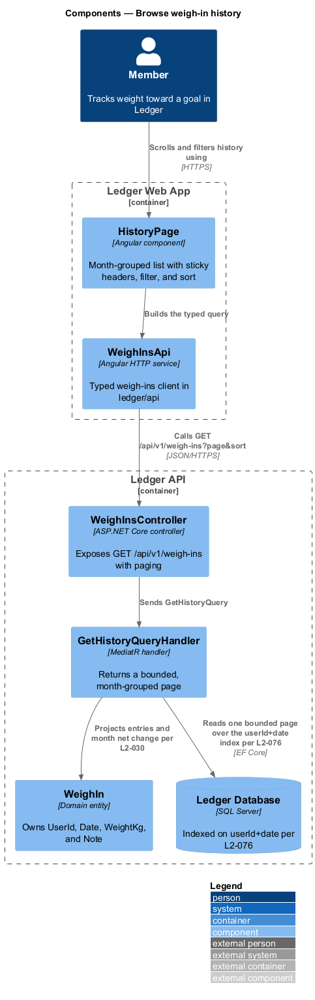
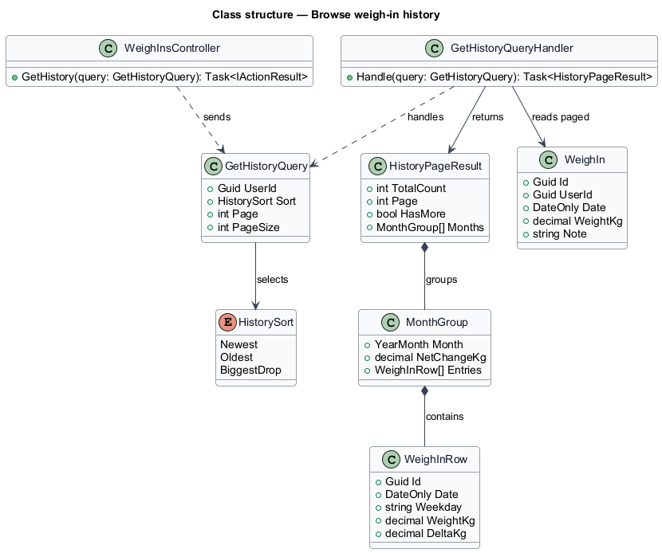
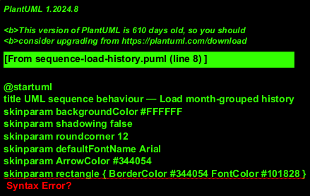
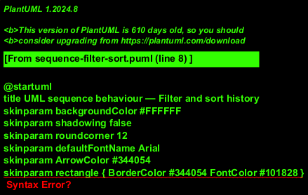

# Browse weigh-in history

## Overview

Ledger is a responsive web application for weight tracking. A *member* is a
person who tracks weight toward a goal in Ledger. Over time a member accumulates
one weigh-in per logged day. This feature presents that record as a browsable
history: entries grouped by month, filterable and sortable, and paged so the
screen stays responsive even for a member with thousands of entries.

*month group* — a set of a member's weigh-ins that fall in one calendar month,
shown under a sticky header that carries the month's net weight change

*page* — a bounded slice of the ordered history returned by one query, so the
client loads history incrementally rather than in full

A member opens the history screen and sees the most recent entries first, grouped
under month headers that each show the month's net change and the total entry
count in view. A member filters and sorts the list — Newest, Oldest, or Biggest
drop — and the selection persists for the session. Each row opens an edit
affordance that reuses the edit-weigh-in slice, and an edit or delete recomputes
the affected month immediately. History reads a bounded page over an indexed query
so the first screenful renders within budget and further pages load as the member
scrolls.

This document assumes no prior knowledge of Ledger's internals. Terms are defined
at first use, and the diagrams show where each part lives.

## Description

The feature is a read-oriented vertical slice that runs from the history screen to
the database. Edit and delete from a row delegate to the edit-weigh-in slice.

- **`HistoryPage`** — Angular component in the Ledger Web App. It renders the
  month-grouped list with sticky headers, the filter and sort control, the empty
  state, and incremental loading as the member scrolls.
- **`WeighInsApi`** — typed Angular HTTP service in the `ledger/api` library. It
  builds the paged history query and returns typed pages.
- **`WeighInsController`** — ASP.NET Core controller in the Ledger API. It exposes
  `GET /api/v1/weigh-ins` with paging and sort parameters, authenticates and
  authorizes the caller, and dispatches the query.
- **`GetHistoryQuery`** — the request object carrying `UserId`, `Sort`, `Page`,
  and `PageSize`.
- **`GetHistoryQueryHandler`** — MediatR handler that reads one bounded page over
  the `userId+date` index, groups the entries by month, and computes each month's
  net change.
- **`HistoryPageResult`** — the typed page result carrying the total count, the
  current page, a has-more flag, and the month groups.
- **`MonthGroup`** — a month's net change and its `WeighInRow` entries.
- **`WeighInRow`** — a projected row carrying the entry's date, weekday, weight,
  and per-entry delta.
- **`WeighIn`** — domain entity that owns `UserId`, `Date`, `WeightKg`, and
  `Note`.
- **`HistorySort`** — enumeration of the sort orders: `Newest`, `Oldest`,
  `BiggestDrop`.

Every query is scoped to the authenticated owner and bounded to a single page, so
a large history never loads in full on the client. `Biggest drop` orders by the
largest favorable day-over-day change. Ordering is stable across pages so
incremental loading does not duplicate or skip rows.

## Requirements

The feature realizes the following level-2 (L2) requirements. Each L2 requirement
refines a level-1 (L1) requirement, cited by identifier.

| L2 ID | Refines (L1) | Requirement |
|-------|--------------|-------------|
| `L2-030` | `L1-006` | Full history is grouped by month with per-month change. |
| `L2-031` | `L1-006` | The user filters/sorts the history. |
| `L2-032` | `L1-006` | History supports inline edit and delete. |
| `L2-033` | `L1-006` | History remains performant at scale. |
| `L2-076` | `L1-017` | Aggregates are computed efficiently. |

## Diagrams

### System context

A member browses their month-grouped weigh-in history through Ledger. The action
reaches no external system.

### Containers

The history request travels from the Ledger Web App to the Ledger API, which reads
a bounded page over the `userId+date` index in the Ledger Database.

### Components

Inside the Ledger Web App, `HistoryPage` builds a paged query through
`WeighInsApi`. Inside the Ledger API, `WeighInsController` dispatches
`GetHistoryQuery` to `GetHistoryQueryHandler`, which reads one bounded page over
the index (`L2-076`) and projects month groups with per-month net change
(`L2-030`).

### Class structure

`WeighInsController` sends `GetHistoryQuery`; `GetHistoryQueryHandler` reads paged
`WeighIn` rows and returns a `HistoryPageResult` that composes `MonthGroup` and
`WeighInRow`. `HistorySort` selects the order.

### Behaviour — load month-grouped history

The member opens the history screen. The handler reads one bounded page over the
index (`L2-076`), groups by month, and computes each month's net change
(`L2-030`); the first screenful renders within budget (`L2-033`). An `opt`
fragment shows a row opening the edit affordance (`L2-032`), and a `loop` shows
further pages appended in stable order as the member scrolls (`L2-033`).

### Behaviour — filter and sort history

The member selects Newest, Oldest, or Biggest drop (`L2-031`). The `alt` fragment
separates an empty result — which shows the empty state (`L2-031`) — from a
populated result, ordered over the index (`L2-076`) with the selection persisted
for the session (`L2-031`). An `opt` fragment shows an edit or delete from a row
recomputing the month net change and grouping immediately (`L2-032`).

