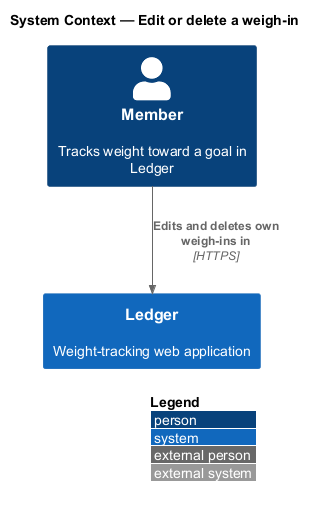
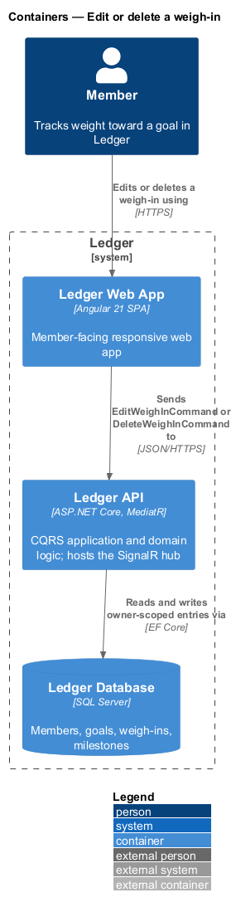
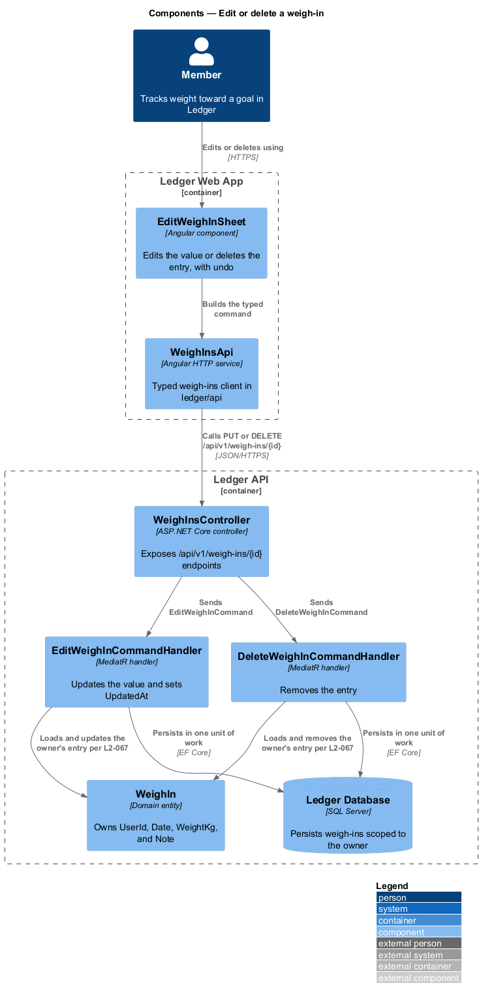
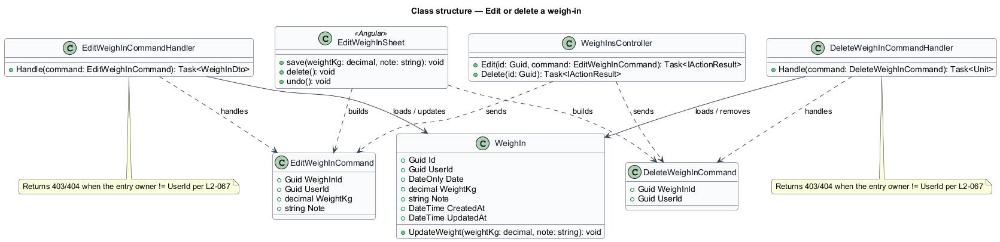
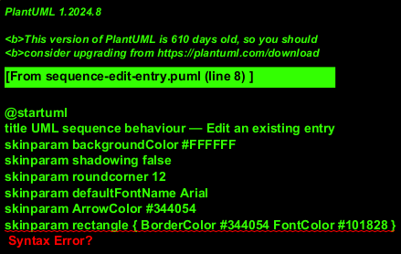
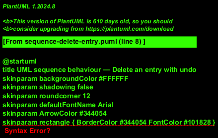

# Edit or delete a weigh-in

## Overview

Ledger is a responsive web application for weight tracking. A *member* is a
person who tracks weight toward a goal in Ledger. Records are not always right the
first time: a member mistypes a value, or logs a weight that later proves wrong.
This feature lets a member correct or remove a recorded entry, with ownership
enforced on the server and a brief opportunity to undo a deletion.

*owner* — the authenticated member whose identifier matches the resource's
`UserId`; only the owner may read or change an entry

*undo window* — the brief interval after a deletion during which the member may
restore the entry with its original date, value, and note

A member opens an entry for edit, changes the value, and saves; the entry updates,
its `UpdatedAt` advances, and dependent computations recompute. A member also
deletes an entry, sees a toast, and may undo within the window; once the window
elapses the deletion is final. Every edit and delete is authorized against the
entry's owner: a request for an entry the member does not own is refused with
`403` or `404` and leaks no data.

This document assumes no prior knowledge of Ledger's internals. Terms are defined
at first use, and the diagrams show where each part lives.

## Description

The feature is a vertical slice that runs from the edit sheet to the database.

- **`EditWeighInSheet`** — Angular component in the Ledger Web App. It opens an
  entry for edit, offers the value and note fields and the delete action, and
  presents the undo toast after a deletion.
- **`WeighInsApi`** — typed Angular HTTP service in the `ledger/api` library. It
  builds the edit and delete requests, and the compensating restore request for
  undo.
- **`WeighInsController`** — ASP.NET Core controller in the Ledger API. It exposes
  `PUT` and `DELETE` on `/api/v1/weigh-ins/{id}`, authenticates the caller, and
  dispatches the command.
- **`EditWeighInCommand`** — the request object carrying `WeighInId`, `UserId`,
  `WeightKg`, and `Note`.
- **`EditWeighInCommandHandler`** — MediatR handler that loads the entry, refuses
  the change when the entry's owner differs from the caller, applies the new
  value, and persists it in one unit of work.
- **`DeleteWeighInCommand`** — the request object carrying `WeighInId` and
  `UserId`.
- **`DeleteWeighInCommandHandler`** — MediatR handler that loads the entry,
  enforces the same ownership check, and removes the entry in one unit of work.
- **`WeighIn`** — domain entity that owns `UserId`, `Date`, `WeightKg`, `Note`,
  and the `CreatedAt`/`UpdatedAt` timestamps.

Ownership is enforced server-side, not merely hidden in the UI: a substituted
identifier is denied by the handler, which chooses `403` or `404` to avoid
leaking whether an entry exists. Undo restores a deleted entry by issuing a
compensating `LogWeighInCommand` with the entry's original date, value, and note.

## Requirements

The feature realizes the following level-2 (L2) requirements. Each L2 requirement
refines a level-1 (L1) requirement, cited by identifier.

| L2 ID | Refines (L1) | Requirement |
|-------|--------------|-------------|
| `L2-018` | `L1-003` | The user edits any recorded entry. |
| `L2-019` | `L1-003` | The user deletes an entry, with a brief opportunity to undo. |
| `L2-067` | `L1-016` | Users can access only their own data. |

## Diagrams

### System context

A member edits and deletes only their own weigh-ins through Ledger. The action
reaches no external system.

### Containers

The edit or delete request travels from the Ledger Web App to the Ledger API,
which reads and writes owner-scoped entries in the Ledger Database.

### Components

Inside the Ledger Web App, `EditWeighInSheet` builds a request through
`WeighInsApi`. Inside the Ledger API, `WeighInsController` dispatches
`EditWeighInCommand` or `DeleteWeighInCommand`; each handler loads the entry and
enforces ownership (`L2-067`) before it updates or removes the `WeighIn` entity.

### Class structure

`WeighInsController` sends `EditWeighInCommand` and `DeleteWeighInCommand`. Each
handler loads the `WeighIn` entity and returns `403`/`404` when the entry's owner
differs from the caller (`L2-067`); the edit handler applies the new value and
advances `UpdatedAt` (`L2-018`).

### Behaviour — edit an existing entry

The member changes the value and saves. The `alt` fragment separates an ownership
failure — `403`/`404` with no data leaked (`L2-067`) — from the owner path, which
applies the new value, advances `UpdatedAt`, and triggers the recomputation of
deltas, averages, badges, and streaks (`L2-018`).

### Behaviour — delete an entry with undo

The member deletes the entry. The outer `alt` fragment enforces ownership
(`L2-067`). On the owner path the entry is removed and a toast with Undo is shown;
the inner `alt` fragment separates an undo within the window — a compensating
restore of the original values (`L2-019`) — from an elapsed window, after which
the deletion is final and analytics exclude the entry (`L2-019`).

