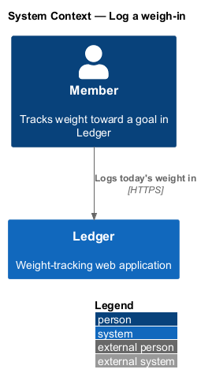
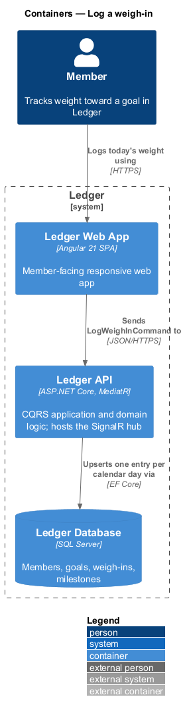
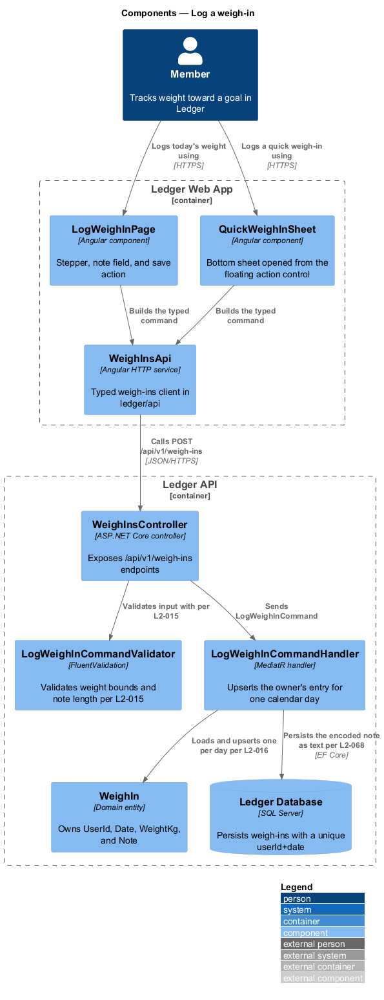
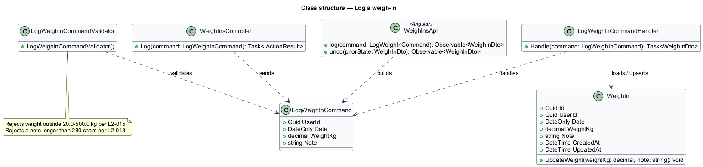
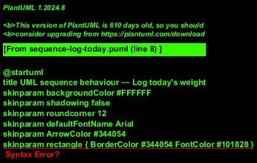
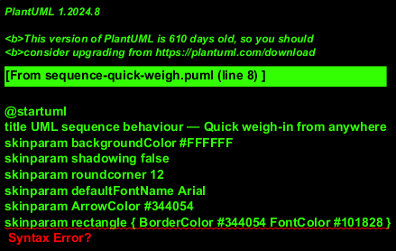
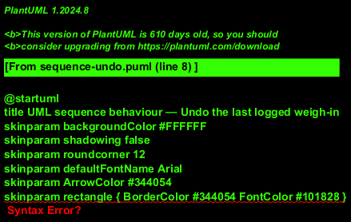

# Log a weigh-in

## Overview

Ledger is a responsive web application for weight tracking. A *member* is a
person who tracks weight toward a goal in Ledger. This feature covers the core
daily action: recording today's weight. It is the most frequent write in the
weight-tracking subsystem, and every trend, streak, and badge derives from the
entries it produces.

*weigh-in* — one weight value a member records for a single calendar day, stored
canonically in kilograms with one decimal place

*upsert* — a write that updates the existing entry for a day when one is present
and inserts a new entry otherwise, so that at most one weigh-in exists per member
per calendar day

The feature offers three ways to record a weight. A member logs today's weight on
the dedicated log screen with a stepper and an optional note. A member also logs
a quick weigh-in from a bottom sheet raised by a floating action control on any
primary screen. Immediately after either, a member may undo the log from the
confirmation toast. Weight input is bounded and validated on both client and
server, and the display unit (kg or lbs) is a per-member preference layered over
the canonical kilogram value.

This document assumes no prior knowledge of Ledger's internals. Terms are defined
at first use, and the diagrams show where each part lives.

## Description

The feature is a vertical slice that runs from the log screen to the database.

- **`LogWeighInPage`** — Angular component in the Ledger Web App. It presents the
  numeric field, the −/+ stepper that adjusts the value by 0.1 in the active
  unit, the optional note field, and the save action. It validates the value
  client-side before it builds a request.
- **`QuickWeighInSheet`** — Angular component that renders the quick weigh-in as
  a bottom sheet with `role="dialog"` and `aria-modal="true"`. It traps focus
  while open and returns focus to the invoking control on close.
- **`WeighInsApi`** — typed Angular HTTP service in the `ledger/api` library. It
  builds the log request, and it builds the compensating request that reverts the
  last log for undo.
- **`WeighInsController`** — ASP.NET Core controller in the Ledger API. It exposes
  the `/api/v1/weigh-ins` endpoints, authenticates and authorizes the caller, and
  dispatches the command.
- **`LogWeighInCommand`** — the request object carrying `UserId`, `Date`,
  `WeightKg`, and `Note`.
- **`LogWeighInCommandValidator`** — validator that rejects a weight outside the
  20.0–500.0 kg bound and a note longer than 280 characters before the handler
  runs.
- **`LogWeighInCommandHandler`** — MediatR handler holding the log logic. It loads
  the owner's entry for the target day, upserts a single entry, and persists the
  change in one unit of work.
- **`WeighIn`** — domain entity that owns `UserId`, `Date`, `WeightKg`, `Note`,
  and the `CreatedAt`/`UpdatedAt` timestamps. Its `UpdateWeight(weightKg, note)`
  method applies a same-day update.

Uniqueness rests on a unique constraint over `userId+date`, so a concurrent
double-submit for the same day yields exactly one entry. The note is stored as
data and encoded on output, so embedded markup never executes. Undo issues a
compensating write: a delete when the log created a new entry, or a restore of the
prior value when the log updated an existing entry.

## Requirements

The feature realizes the following level-2 (L2) requirements. Each L2 requirement
refines a level-1 (L1) requirement, cited by identifier.

| L2 ID | Refines (L1) | Requirement |
|-------|--------------|-------------|
| `L2-013` | `L1-003` | The user records today's weight with a stepper and optional note. |
| `L2-014` | `L1-003` | A floating action control opens a quick weigh-in sheet from any primary screen. |
| `L2-015` | `L1-003` | Weight inputs must be validated on client and server. |
| `L2-016` | `L1-003` | At most one weight entry exists per user per calendar day. |
| `L2-020` | `L1-003` | Logging offers an immediate undo. |
| `L2-068` | `L1-016` | All input is validated; all output is encoded. |
| `L2-079` | `L1-018` | Everything works by keyboard. |

## Diagrams

### System context

A member logs today's weight through Ledger. The action is self-contained: it
reaches no external system.

### Containers

The log request travels from the Ledger Web App to the Ledger API, which upserts
one entry per calendar day in the Ledger Database.

### Components

Inside the Ledger Web App, `LogWeighInPage` and `QuickWeighInSheet` both build a
request through `WeighInsApi`. Inside the Ledger API, `WeighInsController`
validates input (`L2-015`), then dispatches `LogWeighInCommand` to the handler,
which upserts the `WeighIn` entity (`L2-016`) and persists the encoded note
(`L2-068`).

### Class structure

`WeighInsController` sends `LogWeighInCommand`; `LogWeighInCommandValidator`
validates it (`L2-015`); `LogWeighInCommandHandler` handles it and upserts the
`WeighIn` entity. `WeighInsApi` builds the log command and the compensating undo
request.

### Behaviour — log today's weight

The member adjusts the value in 0.1 steps and saves. The `alt` fragment separates
an out-of-bounds value, which returns `400` with the bound message (`L2-015`),
from the happy path, which upserts one entry per calendar day (`L2-016`), stores
the note as encoded text (`L2-068`), and shows a toast with Undo (`L2-020`).

### Behaviour — quick weigh-in from anywhere

The member activates the floating action control on a primary screen. The bottom
sheet opens with `role="dialog"` and `aria-modal="true"` and traps focus
(`L2-079`). The `alt` fragment separates a dismissal — which closes without
saving and returns focus to the control (`L2-079`) — from a save, which upserts
the entry (`L2-016`) and shows a toast with Undo.

### Behaviour — undo the last logged weigh-in

The member activates Undo on the confirmation toast. The `alt` fragment separates
a revert of a newly created entry — a delete that leaves no orphan (`L2-020`) —
from a revert of an update, which restores the prior value (`L2-020`); analytics
return to their prior values in both branches.

